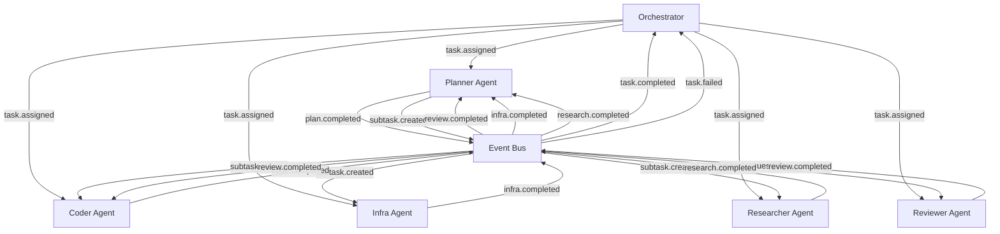

# Agent Catalog

The Agent Catalog is the authoritative registry of all agent types in the Local AI Agents Platform. It defines each agent's responsibilities, boundaries, domains, interfaces, and inter-agent communication patterns.

## Agent Definitions

### Planner

| Field | Value |
|-------|-------|
| **Name** | `planner` |
| **Responsibility** | Decomposes high-level user requests into structured task plans, coordinates multi-agent workflows, and determines the optimal sequencing and assignment of subtasks to specialized agents. |
| **Priority** | High |

**Domain Scope:**

- planning
- research (delegation coordination)

**Boundary Constraints:**

- SHALL NOT execute code directly
- SHALL NOT modify filesystem contents
- SHALL NOT interact with Docker containers
- SHALL NOT push to Git repositories
- SHALL NOT make external API calls that mutate remote state

---

### Coder

| Field | Value |
|-------|-------|
| **Name** | `coder` |
| **Responsibility** | Implements code changes based on task specifications, writes new files, modifies existing source code, runs tests in sandboxed environments, and produces code artifacts ready for review. |
| **Priority** | High |

**Domain Scope:**

- coding

**Boundary Constraints:**

- SHALL NOT deploy to production environments
- SHALL NOT push to protected Git branches without approval
- SHALL NOT modify infrastructure configuration files
- SHALL NOT access external APIs beyond development dependencies
- SHALL NOT delete files outside the assigned workspace

---

### Reviewer

| Field | Value |
|-------|-------|
| **Name** | `reviewer` |
| **Responsibility** | Analyzes code changes for correctness, style compliance, security vulnerabilities, and adherence to project standards. Produces structured review feedback with approval or rejection decisions. |
| **Priority** | Medium |

**Domain Scope:**

- review

**Boundary Constraints:**

- SHALL NOT modify source code directly
- SHALL NOT execute arbitrary shell commands
- SHALL NOT interact with Docker containers
- SHALL NOT push to Git repositories
- SHALL NOT approve its own generated code

---

### Infra

| Field | Value |
|-------|-------|
| **Name** | `infra` |
| **Responsibility** | Manages infrastructure operations including Docker container lifecycle, service configuration, system health checks, and deployment orchestration within approved boundaries. |
| **Priority** | Medium |

**Domain Scope:**

- infrastructure

**Boundary Constraints:**

- SHALL NOT modify application source code
- SHALL NOT perform code reviews
- SHALL NOT execute production deployments without approval gate
- SHALL NOT modify DNS or network configuration without approval
- SHALL NOT access or modify secrets outside designated vault paths

---

### Researcher

| Field | Value |
|-------|-------|
| **Name** | `researcher` |
| **Responsibility** | Gathers information from documentation, codebases, and external knowledge sources to answer technical questions, produce summaries, and provide context for planning and implementation decisions. |
| **Priority** | Low |

**Domain Scope:**

- research

**Boundary Constraints:**

- SHALL NOT modify any files
- SHALL NOT execute shell commands
- SHALL NOT interact with Docker containers
- SHALL NOT push to Git repositories
- SHALL NOT make external API calls that mutate remote state

---

## Agent Interfaces

### Planner Interfaces

**Input:**

| Field | Type | Required | Description |
|-------|------|----------|-------------|
| trigger | event | — | Triggered via `task.assigned` event from Orchestrator |
| task_id | string (UUID) | yes | Unique task identifier |
| task_description | string | yes | Natural language description of the request |
| task_type | string | yes | Classified task type |
| context | object | no | Additional metadata and prior conversation context |
| constraints | object | no | Operational limits and deadline requirements |

**Output:**

| Field | Type | Description |
|-------|------|-------------|
| plan_id | string (UUID) | Unique identifier for the generated plan |
| subtasks | array[object] | Ordered list of subtasks with agent assignments |
| dependencies | array[object] | Dependency graph between subtasks |
| estimated_tokens | integer | Estimated total token consumption |
| coordination_strategy | string | Sequential, parallel, or hybrid execution mode |

---

### Coder Interfaces

**Input:**

| Field | Type | Required | Description |
|-------|------|----------|-------------|
| trigger | event | — | Triggered via `task.assigned` event from Orchestrator |
| task_id | string (UUID) | yes | Unique task identifier |
| specification | object | yes | Detailed coding requirements from Planner |
| workspace_path | string | yes | Isolated workspace root directory |
| git_branch | string | yes | Working branch for changes |
| context_files | array[string] | no | Relevant source files for context |

**Output:**

| Field | Type | Description |
|-------|------|-------------|
| task_id | string (UUID) | Task identifier |
| artifacts | array[object] | List of created/modified files with paths |
| test_results | object | Test execution summary (passed, failed, skipped) |
| commit_sha | string | Git commit hash of changes |
| review_ready | boolean | Whether artifacts are ready for review |

---

### Reviewer Interfaces

**Input:**

| Field | Type | Required | Description |
|-------|------|----------|-------------|
| trigger | event | — | Triggered via `review.requested` event from Orchestrator |
| task_id | string (UUID) | yes | Unique task identifier |
| commit_sha | string | yes | Git commit to review |
| diff | object | yes | Structured diff of changes |
| review_criteria | array[string] | no | Specific aspects to focus on |
| workspace_path | string | yes | Workspace root for file access |

**Output:**

| Field | Type | Description |
|-------|------|-------------|
| task_id | string (UUID) | Task identifier |
| decision | enum (approved, changes_requested, rejected) | Review verdict |
| comments | array[object] | Line-level and general review comments |
| severity_issues | array[object] | Security or critical issues found |
| summary | string | Overall review summary |

---

### Infra Interfaces

**Input:**

| Field | Type | Required | Description |
|-------|------|----------|-------------|
| trigger | event | — | Triggered via `task.assigned` event from Orchestrator |
| task_id | string (UUID) | yes | Unique task identifier |
| operation_type | string | yes | Type of infrastructure operation |
| target_resources | array[string] | yes | Resources to operate on |
| parameters | object | no | Operation-specific configuration |
| approval_status | string | no | Pre-approval status for gated operations |

**Output:**

| Field | Type | Description |
|-------|------|-------------|
| task_id | string (UUID) | Task identifier |
| operation_result | enum (success, failed, pending_approval) | Operation outcome |
| affected_resources | array[object] | Resources modified with before/after state |
| logs | array[string] | Operation execution logs |
| rollback_available | boolean | Whether the operation can be reversed |

---

### Researcher Interfaces

**Input:**

| Field | Type | Required | Description |
|-------|------|----------|-------------|
| trigger | event | — | Triggered via `task.assigned` event from Orchestrator |
| task_id | string (UUID) | yes | Unique task identifier |
| query | string | yes | Research question or topic |
| scope | array[string] | no | Sources to search (docs, codebase, external) |
| max_depth | integer | no | Maximum recursion depth for research |

**Output:**

| Field | Type | Description |
|-------|------|-------------|
| task_id | string (UUID) | Task identifier |
| findings | array[object] | Structured research results with sources |
| summary | string | Concise answer to the research query |
| confidence | float (0-1) | Confidence level in the findings |
| sources | array[string] | References and citations |

---

## Inter-Agent Communication Patterns

### Agent Relationship Diagram

### System Events Table

| Event Name | Producing Agent | Consuming Agent(s) | Payload Description | Triggering Condition |
|-----------|----------------|--------------------|--------------------|---------------------|
| `plan.completed` | Planner | Orchestrator | Plan ID, subtask list, dependency graph, coordination strategy | Planner finishes decomposing a task into subtasks |
| `subtask.created` | Planner | Coder, Infra, Researcher | Subtask ID, parent task ID, specification, assigned agent, priority | Planner creates a subtask assignment for a specialized agent |
| `code.completed` | Coder | Reviewer, Planner | Task ID, commit SHA, artifact list, test results | Coder finishes implementation and marks work as review-ready |
| `review.requested` | Coder | Reviewer | Task ID, commit SHA, diff, review criteria | Coder completes code changes and requests review |
| `review.completed` | Reviewer | Coder, Planner | Task ID, decision (approved/changes_requested/rejected), comments, summary | Reviewer finishes analyzing code changes |
| `infra.completed` | Infra | Planner | Task ID, operation result, affected resources, rollback availability | Infra agent completes an infrastructure operation |
| `research.completed` | Researcher | Planner | Task ID, findings, summary, confidence score, sources | Researcher finishes gathering information |
| `task.failed` | Planner, Coder, Infra, Researcher | Orchestrator | Task ID, agent ID, failure reason, partial results, error category | Any agent encounters an unrecoverable error during execution |
| `approval.requested` | Infra, Coder | Orchestrator | Task ID, agent ID, action type, target resource, risk level | Agent reaches an operation requiring human approval |
| `planner.delegation` | Planner | Researcher | Task ID, research query, scope, urgency | Planner needs additional context before finalizing a plan |

### Directly Interacting Agent Pairs

The following table confirms at least one System_Event exists for each pair of agents that interact directly:

| Agent Pair | Event(s) |
|-----------|----------|
| Planner ↔ Coder | `subtask.created` (Planner → Coder), `code.completed` (Coder → Planner), `review.completed` (Reviewer → Planner on behalf of Coder's work) |
| Planner ↔ Reviewer | `review.completed` (Reviewer → Planner) |
| Planner ↔ Infra | `subtask.created` (Planner → Infra), `infra.completed` (Infra → Planner) |
| Planner ↔ Researcher | `planner.delegation` (Planner → Researcher), `research.completed` (Researcher → Planner) |
| Coder ↔ Reviewer | `review.requested` (Coder → Reviewer), `review.completed` (Reviewer → Coder) |

## Adding New Agent Types

When a new agent type is proposed via a pull request to this catalog, the following requirements apply:

1. A corresponding ADR SHALL be created in `/docs/architecture/adr/` documenting the rationale for the new agent's addition
2. The ADR SHALL follow the template defined in the [Governance Framework](../architecture/governance.md)
3. The new agent entry SHALL include all mandatory fields defined in this catalog (name, responsibility, domain scope, boundary constraints, priority, interfaces, inter-agent events)
4. The [Permissions Model](../security/permissions.md) SHALL be updated with an explicit permission entry for the new agent type

## Related Documents

- [Model Registry](../models/registry.md) — Maps agents to their preferred inference models
- [Tool Registry](../tools/registry.md) — Defines tools available to each agent type
- [Permissions Model](../security/permissions.md) — Specifies resource access boundaries per agent
- [Event Taxonomy](../events/taxonomy.md) — Full event type definitions and delivery semantics
- [Task Types](../architecture/task-types.md) — Defines task categories routed to agents
- [Governance Framework](../architecture/governance.md) — ADR process for adding new agents

## Revision History

| Date | Author | Change Description |
|------|--------|--------------------|
| 2025-07-14 | Platform Architect | Initial agent catalog with 5 agent types, interfaces, and events |
