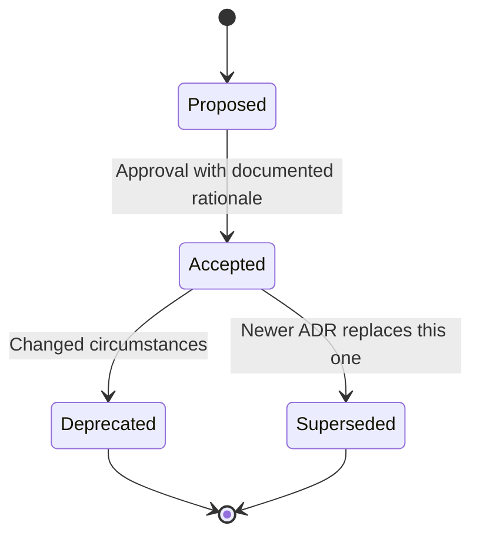

# Governance Framework

This document defines how architectural decisions are made, documented, and evolved within the Local AI Agents Platform, ensuring coherent system evolution and full decision traceability.

## ADR Requirement Triggers

An Architecture Decision Record (ADR) is required for any decision that:

1. **Introduces a new technology** — adding a framework, runtime, database, or external service not previously used in the platform
2. **Removes or replaces an existing component** — substituting one tool, library, or service for another
3. **Changes system boundaries** — modifying the scope or interface between platform phases
4. **Modifies agent responsibilities** — altering what an agent type can do, its domain scope, or its boundary constraints
5. **Alters infrastructure topology** — changing deployment layout, network configuration, or resource allocation patterns

Any team member may identify a trigger condition. When identified, an ADR must be created before the change is implemented.

## ADR Template

Every ADR must include the following fields:

| Field | Description |
|-------|-------------|
| **Title** | A short descriptive name for the decision (used in the filename slug) |
| **Status** | Current lifecycle state: `proposed`, `accepted`, `deprecated`, or `superseded` |
| **Context** | The circumstances, constraints, and forces that motivate this decision |
| **Decision** | The chosen approach and its rationale |
| **Consequences** | The resulting effects — both positive and negative — of this decision |
| **Date** | The date the ADR was created or last changed status, in ISO 8601 format (YYYY-MM-DD) |

Optional fields:

| Field | Description |
|-------|-------------|
| **Superseded By** | Reference to the ADR number that replaces this one (only when status is `superseded`) |

### ADR Markdown Template

```markdown
# {NUMBER}. {Title}

**Status:** {proposed | accepted | deprecated | superseded}

**Date:** YYYY-MM-DD

## Context

{Describe the circumstances, constraints, and forces at play.}

## Decision

{State the decision and the rationale behind it.}

## Consequences

{Describe the positive and negative effects of this decision.}
```

## Decision Lifecycle

ADRs follow a defined lifecycle with explicit states and transitions:



### States

| State | Description |
|-------|-------------|
| **Proposed** | Initial state when the ADR is created. The decision is under consideration. |
| **Accepted** | The decision has been reviewed, rationale documented, and approved by the platform architect. |
| **Deprecated** | The decision is no longer relevant due to changed circumstances. No replacement exists. |
| **Superseded** | A newer ADR replaces this one. The `superseded_by` field references the replacing ADR. |

### Transitions

| From | To | Trigger | Requirements |
|------|----|---------|--------------|
| Proposed | Accepted | Platform architect approval | Rationale must be documented in the ADR before status change |
| Accepted | Deprecated | Changed circumstances | Document why the decision is no longer applicable |
| Accepted | Superseded | New ADR created | Reference the superseding ADR number in `superseded_by` field |

## Platform Architect Role

The **platform architect** is responsible for maintaining architectural coherence across the platform. Their governance responsibilities include:

### Capabilities

- **Propose** — Create new ADRs when a trigger condition is identified
- **Review** — Evaluate proposed ADRs for completeness, consistency, and alignment with platform goals
- **Approve** — Transition an ADR from `proposed` to `accepted`

### Approval Process

1. The proposer creates an ADR in `proposed` status with all required fields completed
2. The platform architect reviews the ADR for:
   - Completeness of context and consequences
   - Alignment with existing architectural decisions
   - Impact on other platform components
3. The platform architect documents the approval rationale within the ADR's Decision section
4. Only after rationale is documented may the status be changed to `accepted`
5. The approval is recorded via a Git commit referencing the ADR number

**Constraint:** Approval requires documenting the rationale in the ADR before changing its status to `accepted`. No ADR may transition to `accepted` without written justification.

## ADR File Naming Convention

ADRs are stored at `/docs/architecture/adr/` using the following naming convention:

```
{NNNN}-{hyphenated-slug}.md
```

Where:

- `{NNNN}` — Zero-padded 4-digit sequential prefix (e.g., `0001`, `0002`, `0013`)
- `{hyphenated-slug}` — Lowercase, hyphen-separated summary of the decision title
- Extension is always `.md`

### Examples

- `0001-use-nginx-over-traefik.md`
- `0002-adopt-redis-for-task-queue.md`
- `0003-vulkan-over-cuda-for-inference.md`

### Numbering Rules

- Numbers are assigned sequentially with no gaps
- The next available number is determined by the highest existing prefix + 1
- Numbers are never reused, even if an ADR is deprecated or superseded

## Related Documents

- [ADR Directory](adr/) — Storage location for all Architecture Decision Records
- [Architecture Overview](overview.md) — High-level system structure and component relationships

## Revision History

| Date | Author | Change Description |
|------|--------|--------------------|
| 2025-07-14 | Platform Architect | Initial governance framework creation |
