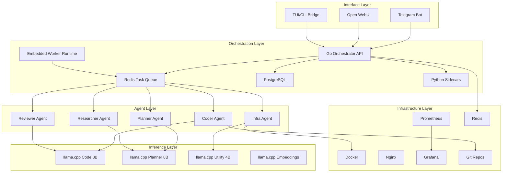
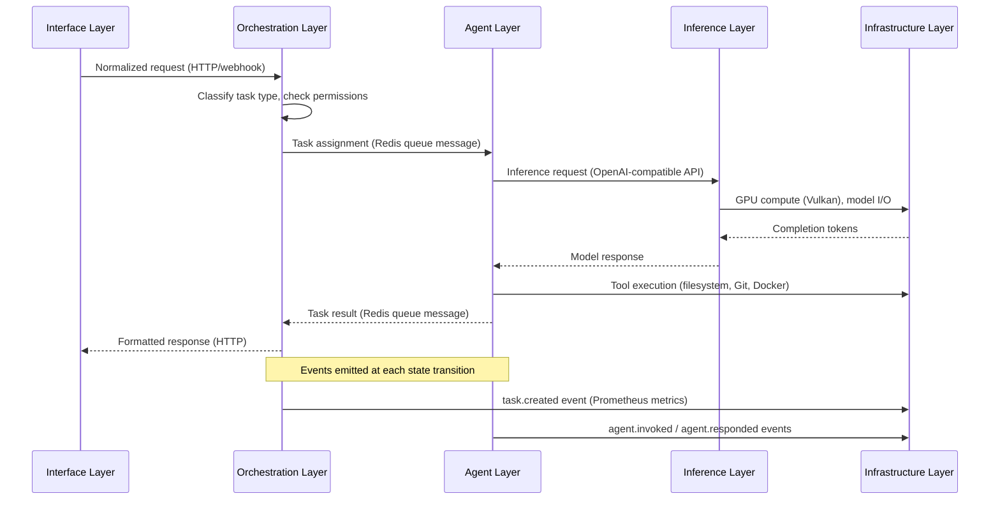
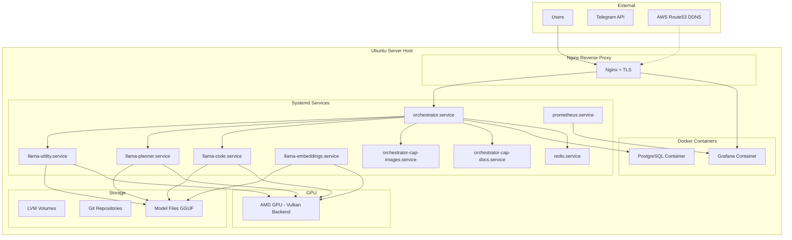

# Architecture Overview

Describes the layered architecture of the Local AI Agents Platform, defining each system layer's responsibility, constituent components, and boundaries with adjacent layers.

## System Layers

The platform is organized into five distinct layers, each with a clear responsibility boundary. Communication flows downward through the stack, with events propagating upward for observability and control.

### Interface Layer

| Attribute | Description |
|-----------|-------------|
| **Responsibility** | Receives user requests from external channels, normalizes input into a common command format, and delivers responses back to users. Acts as the sole entry point for human interaction with the platform. |
| **Components** | Telegram Bot, Open WebUI, TUI/CLI Local Bridge |
| **Upper Boundary** | External users and third-party messaging platforms |
| **Lower Boundary** | Orchestration Layer — passes normalized requests to the Go orchestrator via HTTP or bridge APIs |

**Component Details:**

- **Telegram Bot** — Listens for commands and messages via Telegram Bot API long-polling; translates operator messages into structured task or initiative requests
- **Open WebUI** — Browser-based conversational UI connected to local models and the orchestrator-compatible backend
- **TUI/CLI Local Bridge** — Primary operator cockpit for initiative flow, selective launch, approvals, and local execution bridge management

---

### Orchestration Layer

| Attribute | Description |
|-----------|-------------|
| **Responsibility** | Routes incoming requests to the appropriate agent, manages task lifecycle state, enforces [operational limits](operational-limits.md), coordinates multi-agent workflows, and handles [approval gates](../security/approval-model.md). |
| **Components** | Go Orchestrator API, Embedded Worker Runtime, Redis Task Queue, PostgreSQL Persistence, Capability Sidecars |
| **Upper Boundary** | Interface Layer — receives normalized requests via HTTP/webhook |
| **Lower Boundary** | Agent Layer — dispatches tasks to agents via Redis Task Queue |

**Component Details:**

- **Go Orchestrator API** — Core control plane managing task and initiative state machines, [permission enforcement](../security/permissions.md), scheduling decisions per [resource scheduling](resource-scheduling.md), research, approvals, and event-facing persistence
- **Embedded Worker Runtime** — Claims remote planner, researcher, coder, and reviewer tasks, executes supported flows, and reconciles task trees
- **Redis Task Queue** — Priority-based message broker decoupling orchestration from agent execution; supports priority-first, FIFO-within-priority scheduling
- **PostgreSQL Persistence** — System of record for tasks, initiatives, approvals, artifacts, evaluations, and bridge state
- **Capability Sidecars** — Narrow Python services for document and image processing where the tooling still justifies it

---

### Agent Layer

| Attribute | Description |
|-----------|-------------|
| **Responsibility** | Executes specialized tasks within defined [permission boundaries](../security/permissions.md). Each agent operates autonomously within its domain scope, consuming tasks from the queue and producing structured results. See the [Agent Catalog](../agents/catalog.md) for full definitions. |
| **Components** | Planner Agent, Coder Agent, Reviewer Agent, Infra Agent, Researcher Agent |
| **Upper Boundary** | Orchestration Layer — receives task assignments via Redis Task Queue |
| **Lower Boundary** | Inference Layer — sends prompts to llama.cpp model instances and receives completions |

**Component Details:**

- **Planner Agent** — Decomposes high-level requests into structured task plans and coordinates multi-agent workflows
- **Coder Agent** — Generates, modifies, and refactors code within isolated [workspaces](workspace-isolation.md)
- **Reviewer Agent** — Analyzes code quality, identifies issues, and produces review feedback
- **Infra Agent** — Manages infrastructure configuration, Docker operations, and deployment tasks
- **Researcher Agent** — Gathers information, summarizes documentation, and provides context for other agents

---

### Inference Layer

| Attribute | Description |
|-----------|-------------|
| **Responsibility** | Provides local LLM inference capabilities via llama.cpp instances. Manages model loading/unloading, GPU memory allocation, and concurrent request handling. See the [Model Registry](../models/registry.md) for available models. |
| **Components** | llama.cpp Code (8B), llama.cpp Planner (8B), llama.cpp Utility (4B), llama.cpp Embeddings |
| **Upper Boundary** | Agent Layer — receives inference requests via OpenAI-compatible HTTP API |
| **Lower Boundary** | Infrastructure Layer — runs on Docker containers with GPU passthrough (Vulkan backend) |

**Component Details:**

- **llama.cpp Code (8B)** — Serves the Coder and Reviewer agents with a code-specialized 8B parameter model
- **llama.cpp Planner (8B)** — Serves the Planner and Researcher agents with a reasoning-specialized 8B parameter model
- **llama.cpp Utility (4B)** — Serves the Infra agent and lightweight utility tasks with a 4B parameter model
- **llama.cpp Embeddings** — Provides vector embeddings for semantic search and context retrieval

---

### Infrastructure Layer

| Attribute | Description |
|-----------|-------------|
| **Responsibility** | Provides the foundational runtime environment including containerization, networking, persistent storage, monitoring, and observability. All upper layers depend on infrastructure services. |
| **Components** | Docker, Nginx, Prometheus, Grafana, Redis, Git Repos |
| **Upper Boundary** | Inference Layer — provides container runtime, GPU access, and networking |
| **Lower Boundary** | Physical hardware (Ubuntu Server, AMD GPU with Vulkan, LVM storage) |

**Component Details:**

- **Docker** — Container runtime for all services; provides isolation and reproducible deployments
- **Nginx** — Reverse proxy with TLS termination (Let's Encrypt); routes external traffic to internal services
- **Prometheus** — Metrics collection and alerting; scrapes all service endpoints
- **Grafana** — Visualization dashboards for system and agent metrics
- **Redis** — In-memory data store serving as task queue and ephemeral state cache
- **Git Repos** — Version-controlled repositories for code, configuration, and documentation

---

## Diagrams

### Component Relationships

### Data Flows Between Layers

### Deployment Topology

## Layer Interaction Summary

| Source Layer | Target Layer | Protocol | Payload |
|-------------|-------------|----------|---------|
| Interface → Orchestration | HTTP/Webhook | Normalized task request (JSON) |
| Orchestration → Agent | Redis Queue | Task assignment message with metadata |
| Agent → Inference | HTTP (OpenAI-compatible) | Prompt with context and parameters |
| Agent → Infrastructure | Filesystem/Shell/Docker API | Tool invocations per [permissions](../security/permissions.md) |
| All Layers → Infrastructure | Event bus | [System events](../events/taxonomy.md) per [event schemas](../events/schemas.md) |

## Related Documents

- [Agent Catalog](../agents/catalog.md) — Defines all agent types, responsibilities, boundaries, and inter-agent communication patterns
- [Permissions Model](../security/permissions.md) — Specifies resource access boundaries for each agent type
- [Event Taxonomy](../events/taxonomy.md) — Classifies all system events by category and defines producer-consumer relationships
- [Event Schemas](../events/schemas.md) — Defines the formal structure of system event payloads
- [Task Types](task-types.md) — Categorizes work items and defines lifecycle state machines
- [Operational Limits](operational-limits.md) — Specifies token budgets, timeouts, and retry policies per task type
- [Resource Scheduling](resource-scheduling.md) — Defines model allocation and GPU memory management policies
- [Model Registry](../models/registry.md) — Catalogs available LLM and embedding models with their configurations
- [Tool Registry](../tools/registry.md) — Lists all tools available to agents with authorization rules

## Revision History

| Date | Author | Change Description |
|------|--------|--------------------|
| 2025-07-14 | Platform Architect | Initial architecture overview with 5 layers and 3 Mermaid diagrams |
