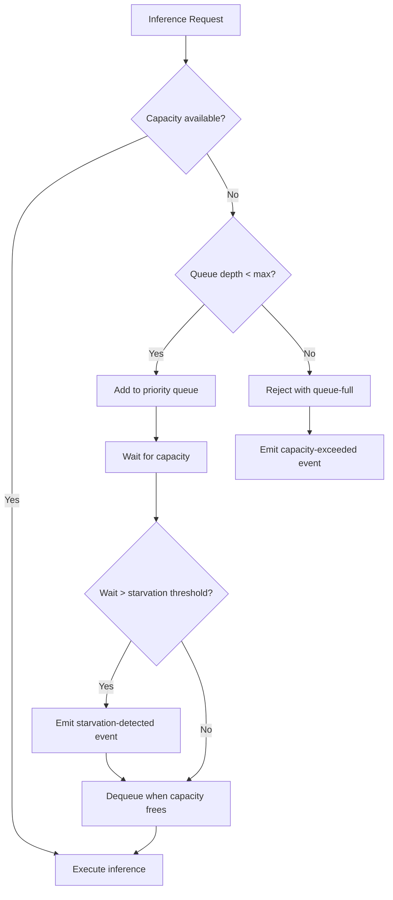

# Resource Scheduling

Defines the resource allocation, scheduling policies, and starvation prevention mechanisms that govern how GPU memory, CPU, and inference capacity are distributed across agent types on the Local AI Agents Platform.

## Model Assignment per Agent Type

Each agent type is assigned a preferred model for inference, with fallback options and resource requirements:

| Agent Type | Priority | Preferred Model | Fallback Models | Min Context Window | VRAM Estimate |
|-----------|----------|----------------|-----------------|-------------------|---------------|
| Planner | High | `qwen2.5-planner-8b` | `qwen2.5-utility-4b` | 32768 tokens | 6144 MB |
| Coder | High | `qwen2.5-coder-8b` | `qwen2.5-utility-4b` | 32768 tokens | 6144 MB |
| Reviewer | Medium | `qwen2.5-coder-8b` | `qwen2.5-utility-4b` | 32768 tokens | 6144 MB |
| Infra | Medium | `qwen2.5-utility-4b` | — | 16384 tokens | 3072 MB |
| Researcher | Low | `qwen2.5-planner-8b` | `qwen2.5-utility-4b` | 32768 tokens | 6144 MB |

### Max Concurrent Executions per Model

| Model | Max Concurrent | Serving Agents |
|-------|---------------|----------------|
| `qwen2.5-coder-8b` | 2 | Coder, Reviewer |
| `qwen2.5-planner-8b` | 2 | Planner, Researcher |
| `qwen2.5-utility-4b` | 4 | Infra (primary), all others (fallback) |
| `qwen2.5-embedding` | 4 | Planner, Coder, Reviewer, Researcher |

Max concurrent executions per model is configurable between 1 and 10.

## GPU Memory Allocation

### VRAM Budget

| Parameter | Value | Range |
|-----------|-------|-------|
| Max VRAM percentage | 80% | 20–100% |
| Total VRAM budget (at 80%) | Calculated at runtime from detected GPU VRAM | — |

The platform allocates up to the configured percentage of total available VRAM across all loaded model instances. The runtime (llama.cpp with Vulkan backend on AMD GPU) reports actual VRAM consumption per model instance.

### CPU Fallback Policy

When VRAM utilization exceeds the configured threshold:

1. New model load requests are served using CPU-only inference (llama.cpp `--n-gpu-layers 0`)
2. CPU fallback activates automatically — no manual intervention required
3. A `system.degraded` event is emitted indicating GPU memory pressure
4. CPU inference operates with reduced throughput but maintains functional correctness
5. When VRAM utilization drops below threshold, subsequent requests resume GPU inference

CPU fallback does not unload models already resident in VRAM. It only affects new inference requests that cannot be served within the VRAM budget.

## Scheduling Rules

### Priority-First FIFO Scheduling

The task queue uses priority-first, FIFO-within-priority scheduling:

| Priority Level | Numeric Value | Agent Types |
|---------------|---------------|-------------|
| High | 1 | Planner, Coder |
| Medium | 2 | Reviewer, Infra |
| Low | 3 | Researcher |

**Scheduling algorithm:**

1. Requests are ordered by numeric priority (lower value = higher priority)
2. Within the same priority level, requests are served in FIFO order (earliest enqueue time first)
3. When inference capacity becomes available, the highest-priority waiting request is dequeued
4. If multiple models have available capacity, the request is routed to the agent's preferred model

### Queue Behavior

## Inference Timeouts

Each agent type has a configurable inference timeout (range: 10–600 seconds):

| Agent Type | Default Timeout | Rationale |
|-----------|----------------|-----------|
| Planner | 120s | Complex task decomposition requires extended reasoning |
| Coder | 180s | Code generation with large context windows |
| Reviewer | 90s | Analysis of diffs with structured output |
| Infra | 60s | Short utility operations and script generation |
| Researcher | 120s | Information gathering and summarization |

When an inference request exceeds its timeout, the platform cancels the request and emits an `agent.timed_out` event.

## Model Loading and Unloading Policies

| Parameter | Default | Range |
|-----------|---------|-------|
| Idle unload duration | 300s | 60–3600s |

**Unloading rules:**

1. A model instance is unloaded from VRAM after remaining idle (no inference requests) for the configured idle duration
2. Models with active requests are never unloaded regardless of idle timers
3. When a request arrives for an unloaded model, the model is loaded on-demand (cold start)
4. The `qwen2.5-utility-4b` model is exempt from unloading (always resident) due to its role as universal fallback
5. Unloading frees VRAM for other model instances or CPU fallback recovery

## Starvation Prevention

### Resource Consumption Limits

No single agent type may consume more than a configurable percentage of total GPU memory or inference slots:

| Parameter | Default | Range |
|-----------|---------|-------|
| Max resource percentage per agent type | 50% | 20–80% |

**Enforcement:**

- The scheduler tracks VRAM consumption and active inference slots per agent type
- When an agent type reaches its configured limit, new requests from that agent type are queued (not rejected)
- Queued requests remain eligible for scheduling once the agent type's consumption drops below the limit
- This ensures that high-priority agents (Planner, Coder) cannot monopolize all inference capacity

### Queue-Full Behavior

| Parameter | Default | Range |
|-----------|---------|-------|
| Max queue depth per model | 100 | 10–1000 |

When the task queue for a model reaches its maximum depth:

1. New requests for that model are rejected with a `queue-full` indication
2. A `capacity-exceeded` System_Event is emitted containing:
   - Model identifier
   - Current queue depth
   - Requesting agent type
   - Timestamp

### Starvation Detection

| Parameter | Default | Range |
|-----------|---------|-------|
| Starvation threshold | 60s | 10–300s |

When an agent type is blocked from inference capacity for longer than the starvation threshold:

1. A `starvation-detected` System_Event is emitted containing:
   - Blocked agent type
   - Wait duration (seconds)
   - Current resource allocation state (VRAM usage per agent type, active slots per model)
   - Timestamp
2. The event triggers a monitoring alert for operator review
3. The scheduler does not automatically preempt running requests — starvation events are informational for capacity planning

## Events

| Event Type | Trigger | Severity | Payload |
|-----------|---------|----------|---------|
| `capacity-exceeded` | Queue reaches max depth | WARNING | model_id, queue_depth, requesting_agent_type, timestamp |
| `starvation-detected` | Agent blocked beyond threshold | WARNING | blocked_agent_type, wait_duration_seconds, resource_allocation_state, timestamp |

Both events follow the schema defined in the [Event Schemas](../events/schemas.md) and are classified under the `system_health` category in the [Event Taxonomy](../events/taxonomy.md).

## Related Documents

- [Model Registry](../models/registry.md) — defines model specifications, VRAM usage, and supported agents
- [Agent Catalog](../agents/catalog.md) — defines agent types, priorities, and domain scopes
- [Event Taxonomy](../events/taxonomy.md) — defines event categories and delivery guarantees
- [Event Schemas](../events/schemas.md) — defines mandatory event payload fields
- [Operational Limits](operational-limits.md) — defines per-task execution timeouts and retry policies

## Revision History

| Date | Author | Change Description |
|------|--------|--------------------|
| 2025-07-14 | Platform Architect | Initial resource scheduling with model assignments, priority scheduling, and starvation prevention |
