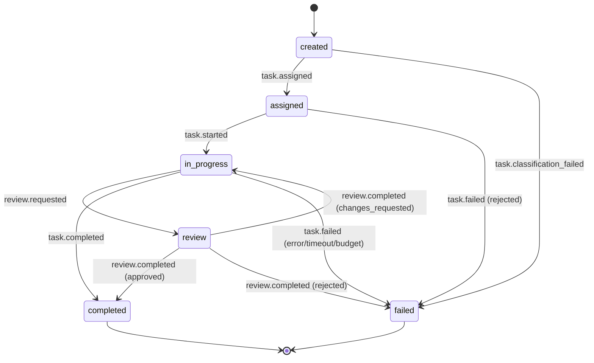

# Task Types Taxonomy

Defines the formal classification system for all task types in the Local AI Agents Platform, establishing routing rules, lifecycle states, and completion criteria that the Orchestrator uses to assign work to the correct agent.

## Primary Task Categories

The platform defines five primary task categories. Every task entering the system must be classified into exactly one category before routing.

| Category | Responsible Agent | Priority | Description |
|----------|------------------|----------|-------------|
| coding | Coder | High | Implementation of code changes, new features, bug fixes, and test writing |
| review | Reviewer | Medium | Analysis of code changes for correctness, style, security, and standards compliance |
| planning | Planner | High | Decomposition of high-level requests into structured task plans and coordination |
| infrastructure | Infra | Medium | Docker lifecycle, service configuration, deployments, and system operations |
| research | Researcher | Low | Information gathering, documentation analysis, and context synthesis |

## Classification Rules

When a task is created, the Orchestrator classifies it into exactly one primary type based on the task description and provided metadata. Classification must complete within a configurable timeout (default: 5 seconds).

### Classification Criteria

| Category | Matching Signals |
|----------|-----------------|
| coding | Keywords: implement, write, fix, refactor, test, code; Metadata: contains file paths to source code, references to functions/classes |
| review | Keywords: review, check, analyze, audit; Metadata: contains commit SHA, diff reference, pull request ID |
| planning | Keywords: plan, design, decompose, coordinate, organize; Metadata: high-level descriptions without specific implementation targets |
| infrastructure | Keywords: deploy, configure, provision, scale, restart, container; Metadata: references to Docker, services, infrastructure configs |
| research | Keywords: find, investigate, summarize, document, explain; Metadata: questions, topic references, documentation requests |

### Unclassified Fallback

If the Orchestrator cannot classify a task into a primary type with sufficient confidence within the classification timeout:

1. The task type is set to `unclassified`
2. The task remains in `created` state and cannot be routed
3. A `task.classification_failed` event is emitted with the task ID and attempted classification details
4. **Manual classification is required** before the task can proceed to assignment
5. An operator must assign a valid primary type via the override interface
6. Once manually classified, normal routing resumes

## Task Type Definitions

### Coding

```yaml
task_type:
  name: coding
  responsible_agent: coder
  input_artifacts:
    - name: task_specification
      description: Detailed coding requirements from Planner including scope and constraints
    - name: workspace_path
      description: Isolated workspace root directory for file operations
    - name: git_branch
      description: Working branch for version-controlled changes
    - name: context_files
      description: Relevant source files providing implementation context
  output_artifacts:
    - name: code_artifacts
      description: List of created or modified files with absolute paths
    - name: test_results
      description: Test execution summary (passed, failed, skipped counts)
    - name: commit_sha
      description: Git commit hash referencing all changes
  completion_conditions:
    - condition: All specified code changes are implemented and committed
      measurable: true
    - condition: Test suite passes with no regressions
      measurable: true
    - condition: Code artifacts are marked review-ready
      measurable: true
```

### Review

```yaml
task_type:
  name: review
  responsible_agent: reviewer
  input_artifacts:
    - name: commit_sha
      description: Git commit hash identifying the changes to review
    - name: diff
      description: Structured diff of all file changes
    - name: review_criteria
      description: Specific aspects to evaluate (correctness, style, security)
    - name: workspace_path
      description: Workspace root for accessing full file context
  output_artifacts:
    - name: review_decision
      description: Verdict — approved, changes_requested, or rejected
    - name: review_comments
      description: Line-level and general review comments with severity
    - name: review_summary
      description: Overall assessment of the changes
  completion_conditions:
    - condition: All files in the diff have been analyzed
      measurable: true
    - condition: A review decision (approved/changes_requested/rejected) is issued
      measurable: true
    - condition: At least one summary comment is provided
      measurable: true
```

### Planning

```yaml
task_type:
  name: planning
  responsible_agent: planner
  input_artifacts:
    - name: task_description
      description: Natural language description of the high-level request
    - name: context
      description: Additional metadata and prior conversation context
    - name: constraints
      description: Operational limits, deadlines, and resource constraints
  output_artifacts:
    - name: task_plan
      description: Structured plan with ordered subtasks and agent assignments
    - name: dependency_graph
      description: DAG of subtask dependencies and execution order
    - name: coordination_strategy
      description: Execution mode — sequential, parallel, or hybrid
    - name: token_estimate
      description: Estimated total token consumption for the plan
  completion_conditions:
    - condition: All subtasks have an assigned agent from the catalog
      measurable: true
    - condition: Dependency graph has no circular references
      measurable: true
    - condition: Estimated token budget is within operational limits
      measurable: true
```

### Infrastructure

```yaml
task_type:
  name: infrastructure
  responsible_agent: infra
  input_artifacts:
    - name: operation_type
      description: Type of infrastructure operation (deploy, configure, scale, restart)
    - name: target_resources
      description: List of resources to operate on (containers, services, configs)
    - name: parameters
      description: Operation-specific configuration values
    - name: approval_status
      description: Pre-approval status for gated operations
  output_artifacts:
    - name: operation_result
      description: Outcome — success, failed, or pending_approval
    - name: affected_resources
      description: Resources modified with before/after state snapshots
    - name: operation_logs
      description: Execution logs for audit trail
    - name: rollback_available
      description: Whether the operation can be reversed
  completion_conditions:
    - condition: Target resources reach the desired state
      measurable: true
    - condition: Operation logs are persisted for audit
      measurable: true
    - condition: Rollback availability is determined and reported
      measurable: true
```

### Research

```yaml
task_type:
  name: research
  responsible_agent: researcher
  input_artifacts:
    - name: query
      description: Research question or topic to investigate
    - name: scope
      description: Sources to search (docs, codebase, external knowledge)
    - name: max_depth
      description: Maximum recursion depth for following references
  output_artifacts:
    - name: findings
      description: Structured research results with source citations
    - name: summary
      description: Concise answer to the research query
    - name: confidence_score
      description: Confidence level (0.0–1.0) in the findings
    - name: sources
      description: List of references and citations used
  completion_conditions:
    - condition: At least one finding with a cited source is produced
      measurable: true
    - condition: A summary answering the original query is provided
      measurable: true
    - condition: Confidence score is reported
      measurable: true
```

## Task Lifecycle States

Every task progresses through a defined set of lifecycle states. Only valid transitions are permitted; invalid transition attempts are rejected and logged.

| State | Description |
|-------|-------------|
| `created` | Task has been submitted and is awaiting classification and assignment |
| `assigned` | Task has been classified and routed to the responsible agent |
| `in-progress` | Agent has acknowledged the task and begun execution |
| `review` | Task output is under review (applies primarily to coding tasks) |
| `completed` | Task has been successfully finished with all completion conditions met |
| `failed` | Task could not be completed after exhausting retries or encountering an unrecoverable error |

## State Transitions

| From | To | Trigger Event | Description |
|------|----|---------------|-------------|
| `created` | `assigned` | `task.assigned` | Orchestrator classifies and routes task to responsible agent |
| `created` | `failed` | `task.classification_failed` | Classification timeout or unresolvable type (remains unclassified without manual intervention) |
| `assigned` | `in-progress` | `task.started` | Agent acknowledges and begins execution |
| `assigned` | `failed` | `task.failed` | Agent rejects task (incompatible, resource unavailable) |
| `in-progress` | `review` | `review.requested` | Agent completes work and submits for review |
| `in-progress` | `completed` | `task.completed` | Agent finishes task that does not require review |
| `in-progress` | `failed` | `task.failed` | Unrecoverable error, timeout, or budget exceeded |
| `review` | `completed` | `review.completed` (approved) | Reviewer approves the output |
| `review` | `in-progress` | `review.completed` (changes_requested) | Reviewer requests changes, task returns to execution |
| `review` | `failed` | `review.completed` (rejected) | Reviewer rejects the output as unacceptable |

## Task Lifecycle State Diagram



## Cross-Reference: Task Types to Agents

Each task type maps to exactly one responsible agent from the [Agent Catalog](../agents/catalog.md). The mapping is deterministic — once classified, a task is always routed to the same agent type.

| Task Type | Agent | Agent Priority | Domain Match |
|-----------|-------|---------------|--------------|
| coding | Coder | High | coding |
| review | Reviewer | Medium | review |
| planning | Planner | High | planning |
| infrastructure | Infra | Medium | infrastructure |
| research | Researcher | Low | research |

## Cross-Reference: Operational Constraints

Each task type operates within bounds defined in the [Operational Limits](operational-limits.md) document:

- **Token budgets** — maximum tokens per task execution (1,000–128,000)
- **Execution timeouts** — maximum wall-clock time per task (10–3,600 seconds)
- **Retry policies** — maximum retry attempts and backoff strategy per task type
- **Loop detection** — repetition threshold (default: 3 consecutive identical outputs)

Exceeding any operational limit triggers task termination and a `task.failed` event with the specific limit violation as the failure reason.

## Related Documents

- [Agent Catalog](../agents/catalog.md) — defines the agents responsible for each task type
- [Operational Limits](operational-limits.md) — specifies token budgets, timeouts, and retry policies per task type
- [Event Taxonomy](../events/taxonomy.md) — defines the events that trigger state transitions
- [Event Schemas](../events/schemas.md) — specifies the payload structure for task lifecycle events
- [Workspace Isolation](workspace-isolation.md) — defines the isolated execution environment per task

## Revision History

| Date | Author | Change Description |
|------|--------|--------------------|
| 2025-07-14 | Platform Architect | Initial task types taxonomy with 5 categories, lifecycle states, and classification rules |
