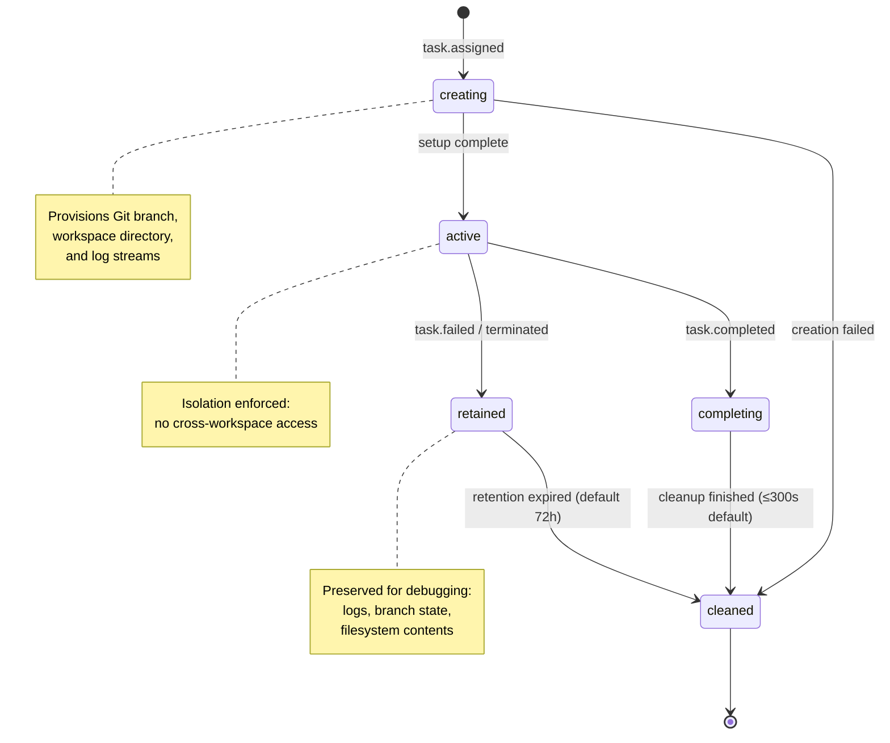

# Workspace Isolation

Defines the isolated execution environment model for agent tasks, including workspace components, lifecycle states, retention policies, size and concurrency limits, and the isolation guarantee that prevents cross-workspace access during execution.

## Workspace Components

Each task execution receives a dedicated workspace comprising three isolated components:

| Component | Description | Isolation Boundary |
|-----------|-------------|-------------------|
| **Git Branch/Worktree** | Dedicated Git branch or worktree created for the task, ensuring code changes are isolated from other concurrent tasks | Branch namespace scoped to task ID |
| **Execution Logs** | Independent log stream capturing all agent actions, tool invocations, and outputs within the task | Log directory scoped to workspace root |
| **Scoped Filesystem** | Filesystem access restricted to the workspace root directory and its subdirectories | OS-level path enforcement |

### Workspace Schema

```yaml
workspace:
  task_id: string           # Unique task identifier (UUID)
  state: enum               # creating | active | completing | retained | cleaned
  git_branch: string        # Isolated branch name (e.g., "task/<task_id>")
  root_directory: string    # Absolute path to workspace root
  max_size_mb: integer      # 100–10,000 (default: 1,024)
  retention_hours: integer  # 1–720, for failed tasks (default: 72)
  cleanup_seconds: integer  # Cleanup window for successful tasks (default: 300)
  isolated: boolean         # Always true during execution
```

## Lifecycle States

A workspace transitions through five defined states from creation to final cleanup:

| State | Description | Entry Trigger | Exit Trigger |
|-------|-------------|---------------|--------------|
| `creating` | Workspace resources are being provisioned (branch, directory, logs) | Task assigned to an agent | Setup completes successfully or fails |
| `active` | Workspace is in use by the assigned agent; isolation enforced | Workspace setup completes | Task reaches completed or failed state |
| `completing` | Cleanup in progress after successful task completion | Task state transitions to "completed" | Cleanup finishes within configured window |
| `retained` | Workspace preserved for debugging after task failure | Task state transitions to "failed" or is terminated | Retention period expires |
| `cleaned` | All workspace resources have been removed | Cleanup or retention period completes | Terminal state (no further transitions) |

### Workspace Lifecycle State Diagram



## Retention Policies

### Failed Workspace Retention

When a task fails or is terminated, the workspace enters the `retained` state to preserve debugging context:

| Parameter | Range | Default | Purpose |
|-----------|-------|---------|---------|
| `retention_hours` | 1–720 hours | 72 hours | Duration to preserve failed workspace state |

Retained workspaces include:
- Complete execution logs
- Git branch state (all commits made during execution)
- Filesystem contents at the point of failure

After the retention period expires, the workspace transitions to `cleaned` and all resources are removed.

### Successful Workspace Cleanup

When a task completes successfully, the workspace enters the `completing` state:

| Parameter | Range | Default | Purpose |
|-----------|-------|---------|---------|
| `cleanup_seconds` | — | 300 seconds | Maximum time allowed for cleanup operations |

Cleanup operations include:
- Removing the workspace directory and all contents
- Cleaning up the isolated Git branch (if merge is not required)
- Archiving execution logs to the central log store

## Size and Concurrency Limits

### Workspace Size Limits

| Parameter | Minimum | Maximum | Default | Unit |
|-----------|---------|---------|---------|------|
| `max_size_mb` | 100 | 10,000 | 1,024 | MB |

Size enforcement:
- The platform monitors workspace disk usage during execution
- If a workspace exceeds `max_size_mb`, the agent receives a warning
- Continued growth beyond the limit may trigger task termination

### Concurrent Workspace Limits

| Parameter | Minimum | Maximum | Default |
|-----------|---------|---------|---------|
| Max concurrent workspaces | 1 | 50 | 10 |

When the concurrent workspace limit is reached:
- New task assignments are queued
- A `workspace-limit-reached` event is emitted
- Queued tasks resume when an active workspace is cleaned

## Failure Preservation

When a task fails or is terminated, the platform preserves the complete workspace state:

| Preserved Artifact | Contents | Access |
|-------------------|----------|--------|
| Execution logs | Full agent interaction history, tool outputs, errors | Read-only during retention |
| Git branch state | All commits, uncommitted changes, working tree | Read-only during retention |
| Filesystem contents | All files created or modified during execution | Read-only during retention |

Preservation guarantees:
- No modifications are made to the workspace after entering `retained` state
- The workspace remains accessible for operator inspection during the retention period
- After `retention_hours` expires, all artifacts are permanently removed

## Successful Cleanup

When a task completes successfully:

1. The workspace transitions to `completing` state
2. Cleanup operations begin immediately
3. All workspace resources are removed within the configured `cleanup_seconds` window (default: 300s)
4. The workspace transitions to `cleaned` state

If cleanup exceeds the configured window, the platform logs a warning but continues the cleanup process to completion.

## Workspace Events

The following system events are emitted during workspace lifecycle operations:

### workspace-limit-reached

Emitted when a new task requires a workspace but the maximum concurrent workspace count has been reached.

| Payload Field | Type | Description |
|--------------|------|-------------|
| `task_id` | string (UUID) | Identifier of the task that cannot be assigned a workspace |
| `current_count` | integer | Number of currently active workspaces |
| `max_count` | integer | Configured maximum concurrent workspace count |

**Severity:** WARNING  
**Category:** system_health

### workspace-creation-failed

Emitted when workspace creation fails due to insufficient disk space or system error.

| Payload Field | Type | Description |
|--------------|------|-------------|
| `task_id` | string (UUID) | Identifier of the task whose workspace creation failed |
| `failure_reason` | string | Description of the failure (e.g., "insufficient disk space", "git branch conflict") |

**Severity:** ERROR  
**Category:** system_health

**Consequence:** The task state is recorded as "failed" and task execution does not proceed.

## Isolation Guarantee

While a task is executing in a workspace (state = `active`), the platform enforces strict isolation:

> **No other agent or task may read or write files within that workspace's root directory during execution.**

### Enforcement Rules

| Rule | Description |
|------|-------------|
| Path-scoped access | Agents can only access files within their assigned `root_directory` and subdirectories |
| No cross-workspace reads | An agent executing in workspace A cannot read files from workspace B |
| No cross-workspace writes | An agent executing in workspace A cannot write files to workspace B |
| Exclusive branch access | The Git branch assigned to a workspace is locked to that workspace during execution |
| Concurrent isolation | Multiple workspaces may exist simultaneously but cannot interact |

### Isolation Lifecycle

- Isolation is **enforced** when the workspace enters the `active` state
- Isolation is **released** when the workspace exits the `active` state (transitions to `completing` or `retained`)
- During `retained` state, the workspace is read-only for operator inspection only

## Related Documents

- [Task Types](task-types.md) — defines task categories that trigger workspace creation
- [Event Taxonomy](../events/taxonomy.md) — full event type definitions including workspace-related events
- [Event Schemas](../events/schemas.md) — canonical event payload structure for workspace events

## Revision History

| Date | Author | Change Description |
|------|--------|--------------------|
| 2025-07-14 | Platform Architect | Initial workspace isolation document with lifecycle, retention, limits, and events |
