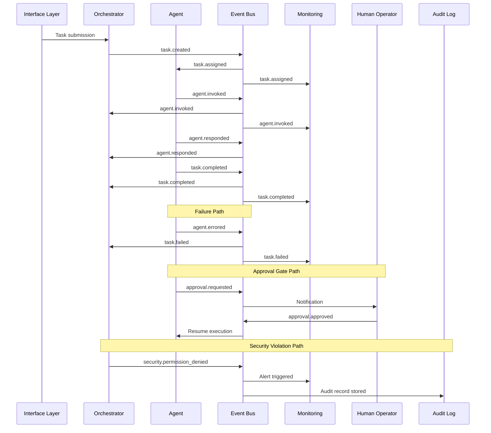

# Event Taxonomy

Defines the complete event classification system for the Local AI Agents Platform, establishing categories, specific event types, producer-consumer relationships, delivery guarantees, and failure handling policies.

## Event Categories

The platform defines five event categories covering all inter-component communication:

| Category | Purpose | Event Count |
|----------|---------|-------------|
| Task Lifecycle | Track task state transitions from creation to completion or failure | 5 |
| Agent Actions | Monitor agent invocation, response, and error states | 4 |
| Approval Requests | Manage human authorization gates for sensitive operations | 4 |
| System Health | Report component availability and degradation | 3 |
| Security Violations | Signal unauthorized access attempts and rate limiting | 3 |

## Event Types and Producer-Consumer Relationships

### Task Lifecycle Events

| Event Type | Producer | Consumer(s) | Trigger Condition |
|-----------|----------|-------------|-------------------|
| `task.created` | Orchestrator | Planner, Monitoring | New task submitted via interface layer |
| `task.assigned` | Orchestrator | Target Agent, Monitoring | Task routed to responsible agent |
| `task.started` | Agent (any) | Orchestrator, Monitoring | Agent begins task execution |
| `task.completed` | Agent (any) | Orchestrator, Monitoring, Notification Service | Agent finishes task successfully |
| `task.failed` | Agent (any) | Orchestrator, Monitoring, Alertmanager | Agent cannot complete task after retries exhausted |

### Agent Action Events

| Event Type | Producer | Consumer(s) | Trigger Condition |
|-----------|----------|-------------|-------------------|
| `agent.invoked` | Agent (any) | Orchestrator, Monitoring | Agent starts processing an assigned task |
| `agent.responded` | Agent (any) | Orchestrator, Monitoring | Agent produces output for a task step |
| `agent.errored` | Agent (any) | Orchestrator, Monitoring, Alertmanager | Agent encounters a non-recoverable error |
| `agent.timed_out` | Orchestrator | Monitoring, Alertmanager | Agent exceeds configured execution timeout |

### Approval Request Events

| Event Type | Producer | Consumer(s) | Trigger Condition |
|-----------|----------|-------------|-------------------|
| `approval.requested` | Agent (any) | Human Operator, Notification Service | Agent reaches a gated action requiring authorization |
| `approval.approved` | Human Operator | Orchestrator, Agent (requesting) | Operator grants permission for gated action |
| `approval.rejected` | Human Operator | Orchestrator, Agent (requesting), Monitoring | Operator denies permission for gated action |
| `approval.expired` | Orchestrator | Agent (requesting), Monitoring, Alertmanager | Approval timeout (default 300s) reached without response |

### System Health Events

| Event Type | Producer | Consumer(s) | Trigger Condition |
|-----------|----------|-------------|-------------------|
| `system.heartbeat` | All Components | Monitoring | Periodic liveness signal (configurable interval, default 30s) |
| `system.degraded` | Monitoring | Alertmanager, Orchestrator | Component health check fails or performance drops below threshold |
| `system.recovered` | Monitoring | Alertmanager, Orchestrator | Previously degraded component returns to healthy state |

### Security Violation Events

| Event Type | Producer | Consumer(s) | Trigger Condition |
|-----------|----------|-------------|-------------------|
| `security.auth_failed` | Orchestrator | Monitoring, Alertmanager, Audit Log | Authentication attempt fails (invalid credentials or token) |
| `security.permission_denied` | Orchestrator | Monitoring, Alertmanager, Audit Log | Agent attempts operation outside granted permissions |
| `security.rate_limited` | Orchestrator | Monitoring, Agent (requesting) | Agent exceeds configured request rate threshold |

## State Transition Events

When a component transitions between defined lifecycle states, it emits a System_Event containing:

- **previous_state**: The state before the transition
- **new_state**: The state after the transition
- **transition_trigger**: The event or condition that caused the transition

This applies to task lifecycle states (created → assigned → started → completed/failed) and workspace lifecycle states (creating → active → completing → retained/cleaned).

## Delivery Guarantees

### At-Least-Once Delivery

The platform guarantees **at-least-once delivery** for all events:

- Every emitted event is persisted before acknowledgment to the producer
- Events are retried until the consumer acknowledges receipt
- Consumers may receive duplicate events and must handle them idempotently

### Best-Effort Ordering

Events from the **same source_component** are delivered in emission order (FIFO per source). Cross-component ordering is best-effort and not guaranteed. Consumers must not rely on global ordering across different producers.

### Consumer-Side Deduplication

Consumers deduplicate events using the combination of:

- **`correlation_id`** (UUID v4) — identifies the logical operation
- **`event_type`** — identifies the specific event within that operation

A consumer that receives an event with a `(correlation_id, event_type)` pair it has already processed must discard the duplicate silently. Consumers should maintain a deduplication window of at least 24 hours.

## Emission Failure Handling

When a component fails to emit an event:

1. **Retry 1**: Immediate retry after 100ms delay
2. **Retry 2**: Retry after 500ms delay (exponential backoff)
3. **Retry 3**: Final retry after 2000ms delay

If all 3 retry attempts fail:

- The emission failure is logged with severity ERROR including: event_type, source_component, correlation_id, and failure reason
- The originating action **continues without blocking** — event emission failure must never halt the producing component's operation
- A `system.degraded` event is emitted via an alternate path (if available) to signal potential event bus issues

## Event Flow Architecture

## Related Documents

- [Event Schemas](schemas.md) — defines the mandatory fields and constraints for all event payloads
- [Event Severity Levels](severity-levels.md) — maps each event type to a severity classification and retention policy
- [Agent Catalog](../agents/catalog.md) — defines the agents that produce and consume events
- [Approval Model](../security/approval-model.md) — details the approval gate workflow referenced by approval events
- [Permissions Model](../security/permissions.md) — defines the permission boundaries that trigger security violation events

## Revision History

| Date | Author | Change Description |
|------|--------|--------------------|
| 2025-07-14 | Platform Architect | Initial event taxonomy with 5 categories, 19 event types, delivery guarantees |
