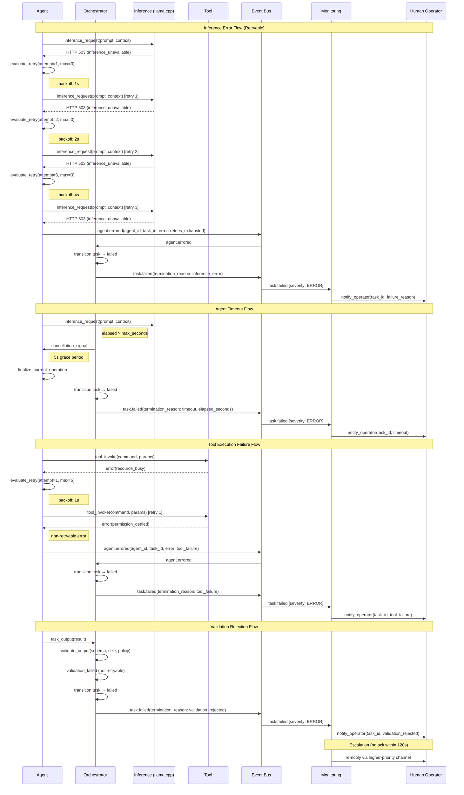

# Error Handling Flow

Defines how failures propagate through the platform, trigger retries with bounded retry counts, and escalate to human operators when automated recovery is exhausted.

## Failure Categories

The platform recognizes four primary failure categories that can occur during task execution:

| Category | Description | Severity | Retryable | Example |
|----------|-------------|----------|-----------|---------|
| Agent Timeout | Agent exceeds configured execution timeout | ERROR | No | Coder agent exceeds 3,600s wall-clock limit |
| Inference Error | LLM inference call fails or returns invalid output | ERROR | Yes | llama.cpp returns HTTP 503, network timeout, rate limit |
| Tool Execution Failure | External tool invocation fails | ERROR | Yes (transient) | Filesystem permission denied, Docker container unavailable |
| Validation Rejection | Agent output fails schema or policy validation | WARNING | No | Output exceeds payload size, invalid format, permission violation |

## Max Retry Count Per Step

Each failure category defines a maximum retry count based on the task type and error nature. Retries only apply to transient, retryable errors.

| Task Type | Max Retries | Backoff Strategy | Retryable Errors |
|-----------|-------------|------------------|------------------|
| coding | 3 | exponential | network_timeout, rate_limit, inference_unavailable |
| review | 2 | fixed | network_timeout, rate_limit, inference_unavailable |
| planning | 3 | exponential | network_timeout, rate_limit, inference_unavailable |
| infrastructure | 5 | exponential | network_timeout, rate_limit, inference_unavailable, resource_busy |
| research | 3 | exponential | network_timeout, rate_limit, inference_unavailable |

### Backoff Timing

| Strategy | Formula | Delays (base = 1s) |
|----------|---------|---------------------|
| fixed | `base_delay` | 1s, 1s, 1s, ... |
| exponential | `base_delay × 2^(attempt - 1)` | 1s, 2s, 4s, 8s, ... |

## Failure Propagation Rules

### Agent Timeout

1. Orchestrator detects elapsed time exceeds configured timeout
2. Orchestrator sends cancellation signal to agent
3. Agent has 5-second grace period to finalize current operation
4. Task state transitions to `failed`
5. Partial results are preserved in workspace
6. `task.failed` event emitted with `termination_reason: timeout` (severity: ERROR)
7. Operator notified via configured channel

### Inference Error

1. Agent receives error response from inference endpoint
2. Agent evaluates error against retryable error categories
3. **If retryable and retries remaining**: apply backoff delay, retry inference call
4. **If retries exhausted**: agent emits `agent.errored` event
5. Orchestrator receives error, transitions task to `failed`
6. `task.failed` event emitted with `termination_reason: inference_error` (severity: ERROR)
7. Operator notified via configured channel

### Tool Execution Failure

1. Agent invokes external tool and receives failure response
2. Agent evaluates whether failure is transient (retryable) or permanent
3. **If transient and retries remaining**: apply backoff delay, retry tool invocation
4. **If permanent or retries exhausted**: agent emits `agent.errored` event
5. Orchestrator receives error, transitions task to `failed`
6. `task.failed` event emitted with `termination_reason: tool_failure` (severity: ERROR)
7. Operator notified via configured channel

### Validation Rejection

1. Agent produces output that fails validation (schema, size, or policy check)
2. Validation rejection is **not retryable** — the output is structurally invalid
3. Agent emits `agent.errored` event with rejection details
4. Orchestrator transitions task to `failed`
5. `task.failed` event emitted with `termination_reason: validation_rejected` (severity: ERROR)
6. If rejection is a permission violation, a `security.permission_denied` event is also emitted (severity: CRITICAL)
7. Operator notified; CRITICAL events page operator within ≤30s SLA

## Escalation to Operators

Escalation follows the severity-based notification policy:

| Severity | Notification Policy | Escalation Rule |
|----------|---------------------|-----------------|
| INFO | Log-only | None |
| WARNING | Notify operator | Re-notify if no ack within 120s |
| ERROR | Notify operator | Re-notify if no ack within 120s |
| CRITICAL | Page operator (≤30s SLA) | Re-notify if no ack within 120s |

### Escalation Sequence

1. Initial failure event emitted with appropriate severity
2. Notification delivered to operator via primary channel (Telegram/Slack)
3. If no acknowledgment within 120 seconds, re-notify via higher-priority channel
4. For CRITICAL events, notification must reach operator within 30 seconds of emission
5. If notification delivery fails after 3 retries (100ms, 500ms, 2000ms backoff), log delivery failure as separate ERROR event

## Error Handling Sequence Diagram

## Event Emission Summary

| Failure Category | Event Type | Severity | Category | Key Payload Fields |
|-----------------|------------|----------|----------|-------------------|
| Agent Timeout | `task.failed` | ERROR | task_lifecycle | task_id, agent_id, elapsed_seconds, timeout_limit_seconds, termination_reason |
| Inference Error | `task.failed` | ERROR | task_lifecycle | task_id, agent_id, error_type, retry_count, termination_reason |
| Tool Execution Failure | `task.failed` | ERROR | task_lifecycle | task_id, agent_id, tool_name, error_type, termination_reason |
| Validation Rejection | `task.failed` | ERROR | task_lifecycle | task_id, agent_id, validation_errors, termination_reason |
| Permission Violation | `security.permission_denied` | CRITICAL | security | agent_id, resource_type, resource_path, access_requested |

## Partial Result Preservation

When any failure terminates a task, the platform preserves all partial results:

- Code changes committed or stashed on the working branch
- Generated files retained in task workspace
- Inference outputs stored in execution log
- Tool execution results stored in task record

Workspace retention follows the configured policy (default: 72 hours for failed tasks) as defined in [Workspace Isolation](../architecture/workspace-isolation.md).

## Related Documents

- [Operational Limits](../architecture/operational-limits.md) — defines token budgets, timeouts, retry policies, and loop detection thresholds
- [Event Taxonomy](../events/taxonomy.md) — defines event categories, types, and producer-consumer relationships
- [Event Schemas](../events/schemas.md) — specifies the payload structure for failure events
- [Event Severity Levels](../events/severity-levels.md) — defines INFO, WARNING, ERROR, CRITICAL classifications with retention and notification policies
- [Agent Catalog](../agents/catalog.md) — defines agent types that participate in error handling flows

## Revision History

| Date | Author | Change Description |
|------|--------|--------------------|
| 2025-07-14 | Platform Architect | Initial error handling flow with 4 failure categories, retry policies, and escalation rules |
