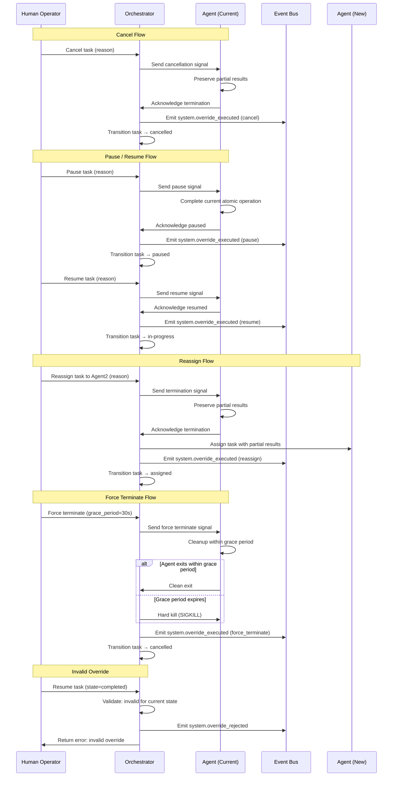

# Human Overrides Flow

Defines the human override operations available to platform operators for intervening in active task executions, including cancel, pause, resume, reassign, modify limits, and force terminate behaviors with auditable event emission.

## Override Operations

The platform supports six override operations that allow operators to intervene in active task executions when agents behave unexpectedly or priorities change.

| Operation | Description | Valid Source States | Target State |
|-----------|-------------|-------------------|--------------|
| Cancel | Gracefully terminate task execution | `assigned`, `in-progress`, `paused` | `cancelled` |
| Pause | Suspend agent execution | `assigned`, `in-progress` | `paused` |
| Resume | Continue suspended execution | `paused` | `in-progress` |
| Reassign | Transfer task to a different agent | `assigned`, `in-progress`, `paused` | `assigned` |
| Modify Limits | Adjust operational limits for active task | `assigned`, `in-progress`, `paused` | (unchanged) |
| Force Terminate | Immediately halt execution with grace period | `assigned`, `in-progress`, `paused` | `cancelled` |

## Auditable Event Emission

Every override operation emits an auditable System_Event conforming to the [Event Schema](../events/schemas.md). The override event payload contains:

| Field | Type | Constraints | Description |
|-------|------|-------------|-------------|
| `operator_id` | string | Required, max 64 chars | Identity of the operator executing the override |
| `task_id` | string | Required | Target task identifier |
| `action_type` | enum | Required | One of: `cancel`, `pause`, `resume`, `reassign`, `modify_limits`, `force_terminate` |
| `timestamp` | string | Required, ISO 8601 | When the override was executed |
| `reason` | string | Optional, max 500 chars | Operator-provided justification for the override |

### Override Event Example

```json
{
  "event_type": "system.override_executed",
  "source_component": "orchestrator",
  "timestamp": "2025-07-14T14:22:05.123Z",
  "correlation_id": "a1b2c3d4-e5f6-4a7b-8c9d-0e1f2a3b4c5d",
  "payload": {
    "operator_id": "operator-001",
    "task_id": "task-20250714-042",
    "action_type": "cancel",
    "reason": "Agent producing incorrect output, needs re-evaluation"
  },
  "schema_version": "1.0.0",
  "severity": "WARNING",
  "category": "system_health"
}
```

## Cancel Behavior

When an operator cancels a running task:

1. The orchestrator sends a cancellation signal to the executing agent
2. The agent **must terminate within 10 seconds** of receiving the signal
3. All partial results produced prior to cancellation are preserved and associated with the task record
4. The task state transitions to `cancelled`
5. A `system.override_executed` event is emitted with `action_type: cancel`

### Partial Result Preservation

- Output artifacts generated before cancellation are retained in the task workspace
- Execution logs up to the cancellation point are preserved
- The task record stores a reference to the preserved partial results for later inspection

### Cancellation Timeout

If the agent does not acknowledge the cancellation within 10 seconds, the platform escalates to a force terminate with the default grace period (see [Force Terminate](#force-terminate-behavior) below).

## Pause and Resume Behavior

### Pause

When an operator pauses a task:

1. The orchestrator signals the agent to suspend execution
2. The agent completes its current atomic operation (e.g., finishes the current inference call)
3. The task state transitions to `paused`
4. The agent holds all in-progress state in memory
5. No further inference calls or tool invocations are made while paused
6. A `system.override_executed` event is emitted with `action_type: pause`

A paused task remains in the `paused` state indefinitely until explicitly resumed or cancelled by an operator.

### Resume

When an operator resumes a paused task:

1. The orchestrator signals the agent to continue execution
2. The agent resumes from the exact point where it was paused
3. The task state transitions back to `in-progress`
4. A `system.override_executed` event is emitted with `action_type: resume`

## Force Terminate Behavior

Force terminate provides an immediate halt mechanism with a configurable grace period for cleanup.

| Parameter | Default | Range | Description |
|-----------|---------|-------|-------------|
| Grace period | 30 seconds | 5–300 seconds | Time allowed for agent cleanup before hard kill |

### Force Terminate Sequence

1. The orchestrator sends a force terminate signal to the agent
2. The agent enters a **grace period** (default: 30 seconds, configurable 5–300 seconds)
3. During the grace period, the agent should:
   - Complete any in-flight I/O operations
   - Flush partial results to persistent storage
   - Release held resources (file handles, network connections)
4. If the agent completes cleanup within the grace period, it exits cleanly
5. If the grace period expires without agent exit, the platform performs a **hard kill** (SIGKILL equivalent)
6. The task state transitions to `cancelled`
7. A `system.override_executed` event is emitted with `action_type: force_terminate`

### Grace Period Configuration

The grace period is configurable per override invocation:

```yaml
force_terminate:
  grace_period_seconds: 30    # Default
  min_grace_period: 5         # Minimum allowed
  max_grace_period: 300       # Maximum allowed
```

## Reassign Behavior

When an operator reassigns a task to a different agent:

1. **Preserve partial results** — All output artifacts and intermediate state produced by the current agent are saved
2. **Terminate current agent** — The current agent execution is terminated (using the cancel flow with 10-second timeout)
3. **Assign new agent** — The task is assigned to the specified target agent
4. **Resume from partial results** — The new agent receives the preserved partial results as input, starting from where the previous agent left off
5. The task state transitions to `assigned` (for the new agent to pick up)
6. A `system.override_executed` event is emitted with `action_type: reassign`

### Reassign Event Payload Extension

The reassign override includes additional fields in the event payload:

| Field | Type | Description |
|-------|------|-------------|
| `previous_agent` | string | Agent type that was executing the task |
| `new_agent` | string | Agent type the task is reassigned to |
| `partial_results_preserved` | boolean | Whether partial results were successfully saved |

## Modify Limits Behavior

When an operator modifies operational limits for an active task:

1. The new limits are validated against allowed ranges (see [Operational Limits](../architecture/operational-limits.md))
2. If valid, the limits are applied immediately to the running task
3. The task continues execution with the updated constraints
4. A `system.override_executed` event is emitted with `action_type: modify_limits`

### Modifiable Limits

| Limit | Range | Description |
|-------|-------|-------------|
| Token budget | 1,000–128,000 | Maximum tokens for task execution |
| Execution timeout | 10–3,600 seconds | Maximum wall-clock time |
| Max retries | 1–10 | Maximum retry attempts |

## Invalid Override Rejection

If an operator attempts an override that is invalid for the current task state, the platform:

1. **Rejects the operation** — The override is not executed
2. **Emits a rejection event** — A System_Event is emitted indicating the invalid attempt

### Invalid Override Scenarios

| Attempted Override | Current State | Reason |
|-------------------|---------------|--------|
| Resume | `in-progress` | Task is not paused |
| Resume | `completed` | Task already finished |
| Cancel | `completed` | Task already finished |
| Cancel | `cancelled` | Task already cancelled |
| Pause | `completed` | Task already finished |
| Pause | `cancelled` | Task already cancelled |
| Reassign | `completed` | Task already finished |

### Invalid Override Event Example

```json
{
  "event_type": "system.override_rejected",
  "source_component": "orchestrator",
  "timestamp": "2025-07-14T14:25:30.456Z",
  "correlation_id": "b2c3d4e5-f6a7-4b8c-9d0e-1f2a3b4c5d6e",
  "payload": {
    "operator_id": "operator-001",
    "task_id": "task-20250714-042",
    "action_type": "resume",
    "current_task_state": "completed",
    "rejection_reason": "Cannot resume a task in 'completed' state"
  },
  "schema_version": "1.0.0",
  "severity": "WARNING",
  "category": "system_health"
}
```

## Override Flow Sequence Diagram



## Related Documents

- [Approval Model](../security/approval-model.md) — Defines gated actions and escalation paths that may precede override operations
- [Event Taxonomy](../events/taxonomy.md) — Full event category definitions including system health events
- [Event Schemas](../events/schemas.md) — Canonical Event_Schema structure for override events
- [Event Severity Levels](../events/severity-levels.md) — Severity classification for override-related events
- [Operational Limits](../architecture/operational-limits.md) — Limit definitions modifiable via the modify limits override

## Revision History

| Date | Author | Change Description |
|------|--------|--------------------|
| 2025-07-14 | Platform Architect | Initial human overrides flow with 6 operations, audit events, and sequence diagrams |
