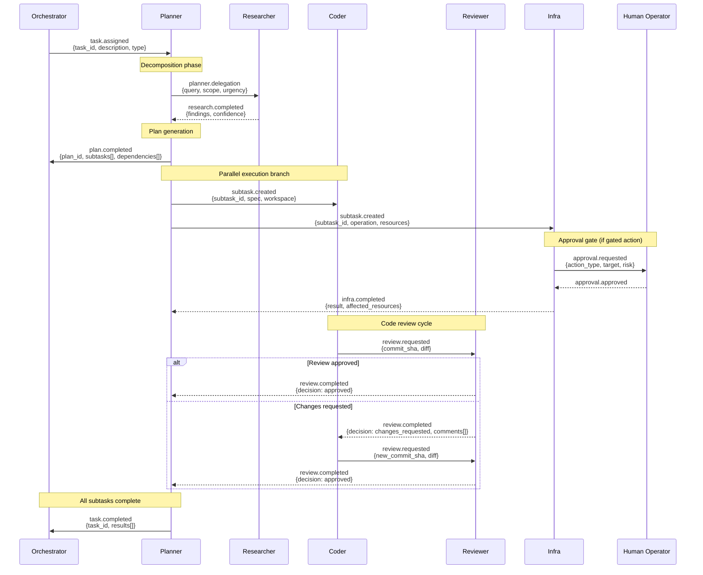

# Multi-Agent Collaboration Flow

Documents how the Planner agent decomposes complex tasks and coordinates execution across Coder, Reviewer, Infra, and Researcher agents, including handoff triggers, payload contracts, and approval gates.

## Overview

The multi-agent collaboration flow is the primary pattern for handling tasks that require more than one agent's expertise. The Planner acts as the coordination hub — it receives a high-level task, decomposes it into subtasks, assigns each to the appropriate specialist agent, and tracks progress until all subtasks complete or a failure triggers escalation.

## Planner Decomposition

When the Orchestrator assigns a complex task to the Planner, the following decomposition process occurs:

1. **Analyze task scope** — Planner evaluates the task description and classifies required capabilities (coding, infrastructure, research, review)
2. **Generate subtask graph** — Planner produces an ordered list of subtasks with dependency relationships
3. **Assign agents** — Each subtask is mapped to the responsible agent based on domain scope
4. **Select coordination strategy** — Planner chooses sequential, parallel, or hybrid execution based on dependency graph
5. **Emit plan** — Planner publishes `plan.completed` event with the full subtask graph

### Coordination Strategies

| Strategy | When Used | Behavior |
|----------|-----------|----------|
| Sequential | Subtasks have linear dependencies | Each subtask starts only after its predecessor completes |
| Parallel | Independent subtasks with no shared state | Multiple agents execute simultaneously |
| Hybrid | Mix of dependent and independent subtasks | Independent branches run in parallel; dependent steps wait |

## Agent Handoff Triggers

Each handoff between agents is triggered by a specific event. The table below defines when control passes from one agent to another:

| Handoff | Trigger Event | Condition |
|---------|---------------|-----------|
| Planner → Coder | `subtask.created` | Subtask type is `coding` and all dependencies satisfied |
| Planner → Infra | `subtask.created` | Subtask type is `infrastructure` and all dependencies satisfied |
| Planner → Researcher | `planner.delegation` | Planner needs additional context before finalizing plan |
| Coder → Reviewer | `review.requested` | Coder marks work as `review_ready = true` |
| Reviewer → Coder | `review.completed` | Decision is `changes_requested` — Coder must iterate |
| Reviewer → Planner | `review.completed` | Decision is `approved` — subtask complete |
| Infra → Planner | `infra.completed` | Infrastructure operation finishes (success or failure) |
| Researcher → Planner | `research.completed` | Research findings delivered back to Planner |

## Input/Output Payloads

### Planner → Coder (subtask.created)

```yaml
input:
  subtask_id: string (UUID)
  parent_task_id: string (UUID)
  specification:
    description: string
    acceptance_criteria: array[string]
    context_files: array[string]
  assigned_agent: "coder"
  workspace_path: string
  git_branch: string
  priority: enum (High | Medium | Low)
```

### Planner → Infra (subtask.created)

```yaml
input:
  subtask_id: string (UUID)
  parent_task_id: string (UUID)
  specification:
    operation_type: string
    target_resources: array[string]
    parameters: object
  assigned_agent: "infra"
  priority: enum (High | Medium | Low)
```

### Planner → Researcher (planner.delegation)

```yaml
input:
  task_id: string (UUID)
  research_query: string
  scope: array[string]       # docs, codebase, external
  urgency: enum (high | normal | low)
  max_depth: integer
```

### Coder → Reviewer (review.requested)

```yaml
input:
  task_id: string (UUID)
  commit_sha: string
  diff:
    files_changed: integer
    insertions: integer
    deletions: integer
    file_diffs: array[object]
  review_criteria: array[string]
  workspace_path: string
```

### Reviewer → Coder (review.completed — changes_requested)

```yaml
output:
  task_id: string (UUID)
  decision: "changes_requested"
  comments:
    - file: string
      line: integer
      severity: enum (critical | suggestion | nit)
      message: string
  summary: string
```

### Reviewer → Planner (review.completed — approved)

```yaml
output:
  task_id: string (UUID)
  decision: "approved"
  summary: string
  severity_issues: array[object]   # empty when approved
```

### Infra → Planner (infra.completed)

```yaml
output:
  task_id: string (UUID)
  operation_result: enum (success | failed | pending_approval)
  affected_resources:
    - resource_id: string
      before_state: object
      after_state: object
  logs: array[string]
  rollback_available: boolean
```

### Researcher → Planner (research.completed)

```yaml
output:
  task_id: string (UUID)
  findings: array[object]
  summary: string
  confidence: float (0-1)
  sources: array[string]
```

## Approval Gates

Certain operations within the collaboration flow require human confirmation before proceeding. These gates pause the executing agent and notify the operator.

| Gate | Triggering Agent | Condition | Risk Level |
|------|-----------------|-----------|------------|
| Production deployment | Infra | `operation_type` targets production environment | Critical |
| Protected branch push | Coder | Git push to `main` or `production` branch | High |
| Destructive filesystem op | Coder, Infra | File/directory deletion outside workspace | High |
| External mutation | Coder, Infra | POST/PUT/DELETE/PATCH to external API | High |

When an approval gate is reached:

1. Agent emits `approval.requested` event with action type, target resource, and risk level
2. Agent execution is paused
3. Primary approver is notified (50% of timeout window to respond)
4. If unresponsive, escalation to secondary approver (remaining timeout)
5. On approval: `approval.approved` emitted, agent resumes
6. On rejection: `approval.rejected` emitted, action cancelled, state preserved
7. On timeout (default 300s): `approval.expired` emitted, action cancelled

## Collaboration Sequence Diagram



## Failure Handling Within Collaboration

When a subtask fails during multi-agent collaboration:

| Failure Type | Detecting Component | Response |
|-------------|--------------------|---------| 
| Agent timeout | Orchestrator | Emit `agent.timed_out`, Planner notified, may reassign or fail parent task |
| Inference error | Agent | Emit `agent.errored`, retry per operational limits, then escalate to Planner |
| Review rejection | Reviewer | Emit `review.completed` with `rejected`, Planner decides: reassign or fail |
| Infra operation failure | Infra | Emit `infra.completed` with `failed`, Planner evaluates rollback options |
| Approval timeout | Orchestrator | Emit `approval.expired`, action cancelled, Planner re-plans without gated step |

The Planner maintains awareness of all active subtasks and can:
- Reassign a failed subtask to the same agent (retry)
- Cancel dependent subtasks if a critical predecessor fails
- Emit `task.failed` to the Orchestrator if recovery is not possible

## Related Documents

- [Agent Catalog](../agents/catalog.md) — Defines agent types, interfaces, and inter-agent events
- [Event Taxonomy](../events/taxonomy.md) — Full event type definitions and producer-consumer relationships
- [Event Schemas](../events/schemas.md) — Canonical event payload structure and validation rules
- [Approval Model](../security/approval-model.md) — Gate behavior, escalation paths, and timeout policies
- [Task Types](../architecture/task-types.md) — Task classification that drives agent assignment
- [Operational Limits](../architecture/operational-limits.md) — Token budgets, timeouts, and retry policies

## Revision History

| Date | Author | Change Description |
|------|--------|--------------------|
| 2025-07-14 | Platform Architect | Initial multi-agent collaboration flow with Planner coordination and approval gates |
