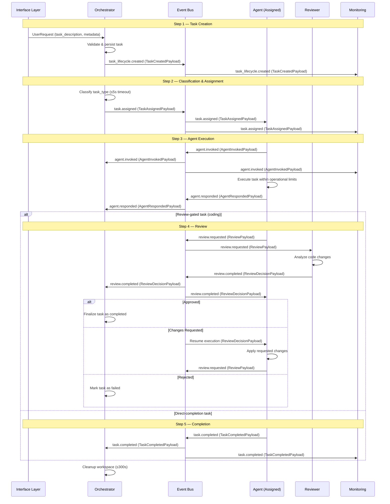
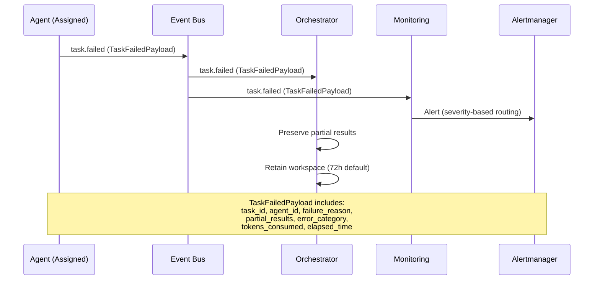

# Task Execution Flow

Documents the standard task execution flow from creation through assignment, execution, review, and completion, specifying participating agents, triggers, data payloads, and terminal conditions at each step.

## Flow Overview

The task execution flow is the primary workflow in the Local AI Agents Platform. Every task follows a deterministic path through lifecycle states, with the Orchestrator coordinating transitions and agents performing the work. The flow supports both review-gated tasks (coding) and direct-completion tasks (infrastructure, research, planning).

## Standard Flow Steps

### Step 1: Task Creation

| Attribute | Value |
|-----------|-------|
| **Participating Agent** | Orchestrator |
| **Trigger** | User request via Interface Layer (Telegram, Slack, Web UI) |
| **Data Payload** | `TaskCreatedPayload`: task_id (UUID), task_description (string), metadata (object), source_channel (string), timestamp (ISO 8601) |
| **Terminal Conditions** | **Success:** Task persisted with state `created`, `task_lifecycle.created` event emitted. **Failure:** Validation error (missing description, invalid metadata), task rejected before persistence. |

The Orchestrator receives a request from the Interface Layer, validates the input, generates a unique task identifier, and persists the task in `created` state. A `task_lifecycle.created` event is emitted to the Event Bus.

### Step 2: Classification and Assignment

| Attribute | Value |
|-----------|-------|
| **Participating Agent** | Orchestrator |
| **Trigger** | `task_lifecycle.created` event |
| **Data Payload** | `TaskAssignedPayload`: task_id (UUID), task_type (enum: coding, review, planning, infrastructure, research), assigned_agent (string), priority (enum: High, Medium, Low), input_artifacts (array[string]) |
| **Terminal Conditions** | **Success:** Task classified into a primary type, routed to responsible agent, state transitions to `assigned`, `task.assigned` event emitted. **Failure:** Classification timeout (default 5s) or insufficient confidence — task marked `unclassified`, `task.classification_failed` event emitted, manual intervention required. |

The Orchestrator classifies the task into one of five primary categories (coding, review, planning, infrastructure, research) based on description keywords and metadata signals. Once classified, the task is routed to the responsible agent as defined in the [Agent Catalog](../agents/catalog.md).

### Step 3: Agent Execution

| Attribute | Value |
|-----------|-------|
| **Participating Agent** | Assigned agent (Planner, Coder, Reviewer, Infra, or Researcher) |
| **Trigger** | `task.assigned` event received by the target agent |
| **Data Payload** | Agent-specific input payload (see [Agent Catalog — Interfaces](../agents/catalog.md)): task_id (UUID), specification/query (object), workspace_path (string), context (object), constraints (object) |
| **Terminal Conditions** | **Success:** Agent produces output artifacts, state transitions to `review` (if review-gated) or `completed` (if direct-completion), corresponding event emitted. **Failure:** Unrecoverable error, timeout exceeded, token budget exhausted, or loop detected — state transitions to `failed`, `task.failed` event emitted. |

The assigned agent acknowledges the task (emitting `agent.invoked`), performs its specialized work within the isolated workspace, and produces output artifacts. During execution, the agent operates within [Operational Limits](../architecture/operational-limits.md) (token budgets, timeouts, retry policies).

### Step 4: Review (Conditional)

| Attribute | Value |
|-----------|-------|
| **Participating Agent** | Reviewer |
| **Trigger** | `review.requested` event emitted by Coder upon code completion |
| **Data Payload** | `ReviewPayload`: task_id (UUID), commit_sha (string), diff (object), review_criteria (array[string]), workspace_path (string) |
| **Terminal Conditions** | **Success (approved):** Reviewer issues `approved` decision, state transitions to `completed`, `review.completed` event emitted. **Changes requested:** Reviewer issues `changes_requested`, state transitions back to `in-progress`, Coder resumes work. **Failure (rejected):** Reviewer issues `rejected` decision, state transitions to `failed`. |

This step applies primarily to coding tasks. The Reviewer agent analyzes code changes for correctness, style, security, and standards compliance. The review decision determines whether the task completes, returns for rework, or fails.

### Step 5: Completion

| Attribute | Value |
|-----------|-------|
| **Participating Agent** | Orchestrator |
| **Trigger** | `task.completed` event (direct completion) or `review.completed` event with `approved` decision |
| **Data Payload** | `TaskCompletedPayload`: task_id (UUID), agent_id (string), output_artifacts (array[object]), execution_duration_ms (integer), tokens_consumed (integer) |
| **Terminal Conditions** | **Success:** Task state finalized as `completed`, workspace cleanup initiated (within 300s), results persisted. **Failure:** N/A — completion is a terminal state. |

The Orchestrator finalizes the task record, triggers workspace cleanup as defined in [Workspace Isolation](../architecture/workspace-isolation.md), and persists the output artifacts for downstream consumption.

## Sequence Diagram

## Failure Path

When a task fails at any step, the following sequence occurs:

### Failure Categories

| Category | Trigger | Event Emitted |
|----------|---------|---------------|
| Classification failure | Timeout or low confidence during Step 2 | `task.classification_failed` |
| Agent rejection | Agent cannot handle assigned task | `task.failed` |
| Timeout exceeded | Execution exceeds configured limit | `task.failed` (reason: timeout) |
| Token budget exceeded | Agent consumes max allowed tokens | `task.failed` (reason: budget_exceeded) |
| Loop detected | 3+ consecutive identical outputs | `task.failed` (reason: loop_detected) |
| Unrecoverable error | Tool failure, inference error | `task.failed` (reason: unrecoverable_error) |
| Review rejected | Reviewer rejects output | `review.completed` (decision: rejected) |

## Payload Type Reference

| Payload Type | Key Fields | Used In |
|-------------|------------|---------|
| `TaskCreatedPayload` | task_id, task_description, metadata, source_channel, timestamp | Step 1 |
| `TaskAssignedPayload` | task_id, task_type, assigned_agent, priority, input_artifacts | Step 2 |
| `AgentInvokedPayload` | agent_id, task_id, model_id, context_tokens, tools_available | Step 3 |
| `AgentRespondedPayload` | agent_id, task_id, output_artifacts, tokens_consumed | Step 3 |
| `ReviewPayload` | task_id, commit_sha, diff, review_criteria, workspace_path | Step 4 |
| `ReviewDecisionPayload` | task_id, decision, comments, severity_issues, summary | Step 4 |
| `TaskCompletedPayload` | task_id, agent_id, output_artifacts, execution_duration_ms, tokens_consumed | Step 5 |
| `TaskFailedPayload` | task_id, agent_id, failure_reason, partial_results, error_category | Failure path |

All payloads conform to the [Event_Schema](../events/schemas.md) envelope structure (event_type, source_component, timestamp, correlation_id, payload, schema_version, severity, category).

## State Transitions Summary

| From State | To State | Trigger Event | Step |
|-----------|----------|---------------|------|
| — | `created` | User request received | 1 |
| `created` | `assigned` | `task.assigned` | 2 |
| `created` | `failed` | `task.classification_failed` | 2 |
| `assigned` | `in-progress` | `task.started` | 3 |
| `assigned` | `failed` | `task.failed` (agent rejection) | 3 |
| `in-progress` | `review` | `review.requested` | 4 |
| `in-progress` | `completed` | `task.completed` | 5 |
| `in-progress` | `failed` | `task.failed` (error/timeout/budget) | 3 |
| `review` | `completed` | `review.completed` (approved) | 4→5 |
| `review` | `in-progress` | `review.completed` (changes_requested) | 4→3 |
| `review` | `failed` | `review.completed` (rejected) | 4 |

For the complete state diagram, see [Task Types — Lifecycle States](../architecture/task-types.md).

## Related Documents

- [Agent Catalog](../agents/catalog.md) — defines agent types, interfaces, and inter-agent events
- [Task Types](../architecture/task-types.md) — defines task categories, lifecycle states, and state transitions
- [Event Taxonomy](../events/taxonomy.md) — defines event categories and producer-consumer relationships
- [Event Schemas](../events/schemas.md) — defines the Event_Schema envelope structure and field constraints

## Revision History

| Date | Author | Change Description |
|------|--------|--------------------|
| 2025-07-14 | Platform Architect | Initial task execution flow with 5 steps, sequence diagrams, and payload types |
