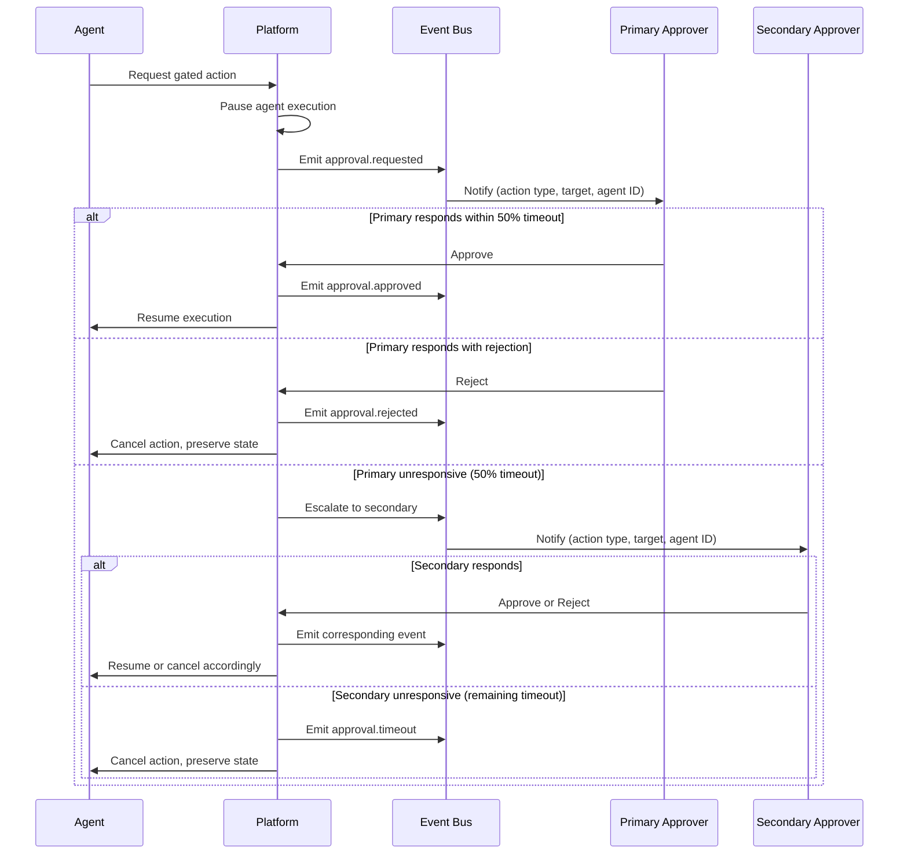

# Approval Model

The Approval Model defines which agent actions require human authorization before execution and specifies the gate behavior, escalation paths, and operator response handling for the Local AI Agents Platform.

## Action Classification

All agent actions are classified into two categories: **autonomous** (proceed without human intervention) and **gated** (require explicit human approval before execution).

### Autonomous Actions

Actions that do not require approval and execute immediately upon agent request:

| Category | Examples |
|----------|----------|
| Read-only filesystem | Reading source files, listing directories, checking file metadata |
| Local code execution | Running tests in sandboxed environments, linting, static analysis |
| Git read operations | Fetching, pulling, viewing logs, diffing branches |
| Internal API queries | Querying orchestrator state, reading task metadata |
| Research operations | Searching documentation, querying embeddings, reading knowledge bases |
| Docker read operations | Inspecting containers, viewing logs, listing images |
| Non-mutating network | GET requests to external APIs, DNS lookups |

### Gated Actions

Actions that require human approval before execution:

| Gated Action | Rationale | Risk Level |
|--------------|-----------|------------|
| Production deployments | Affects live services and end users | Critical |
| Destructive filesystem operations | File/directory deletion, move, or overwrite of non-workspace files | High |
| External API calls that mutate remote state | POST, PUT, DELETE, or PATCH requests to external services | High |
| Git pushes to protected branches | Modifies shared codebase history | High |

## Approval Gate Behavior

### Pause-and-Notify

When an agent reaches an Approval_Gate, the platform performs the following sequence:

1. **Pause execution** — The agent's current task is suspended; no further actions are taken
2. **Emit approval request event** — An `approval.requested` System_Event is published to the event bus
3. **Notify operator** — A notification is sent via the configured notification channel containing:
   - **Action type** — The category of gated action (e.g., "production deployment", "destructive filesystem operation")
   - **Target resource** — The specific resource affected (e.g., file path, API endpoint, branch name)
   - **Requesting agent identifier** — The agent name and task ID that triggered the gate

The agent remains paused until the operator responds or the timeout expires.

### Timeout Behavior

| Parameter | Value |
|-----------|-------|
| Default timeout | 300 seconds |
| Configurable | Yes (per-gate or global) |
| Timeout action | Cancel pending action |
| Timeout event | `approval.timeout` System_Event emitted |

If no operator response is received within the configured timeout period (default: 300 seconds):

1. The pending action is cancelled
2. A timeout `System_Event` is emitted containing:
   - Task identifier
   - Agent identifier
   - Action type
   - Target resource
   - Configured timeout value
   - Timestamp of expiration
3. The agent's task is marked as requiring re-initiation
4. System state is preserved as it was before the action was requested

## Escalation Paths

The approval model supports a maximum of **2 escalation levels** to ensure timely responses.

| Level | Role | Trigger | Response Window |
|-------|------|---------|-----------------|
| Primary | Designated approver | Approval gate reached | 50% of configured timeout (default: 150s) |
| Secondary | Escalation approver | Primary unresponsive | Remaining 50% of timeout (default: 150s) |

### Escalation Rules

1. When an approval gate is triggered, the **primary approver** is notified immediately
2. If the primary approver does not respond within **50% of the configured timeout** (default: 150 seconds), they are considered unavailable
3. The system escalates to the **secondary approver** (escalation level 1)
4. If the secondary approver does not respond within the remaining timeout window, the action times out and is cancelled
5. No further escalation levels exist beyond level 2 — timeout cancellation is the final fallback

## Operator Actions

### Approve

When an operator approves a gated action:

1. An `approval.approved` System_Event is emitted
2. The agent resumes execution of the paused action
3. The approval decision is logged with operator identity and timestamp

### Reject

When an operator rejects a gated action:

1. The pending action is **cancelled immediately**
2. An `approval.rejected` System_Event is emitted containing:
   - Task identifier
   - Agent identifier
   - Action type
   - Target resource
   - Rejecting operator identity
   - Rejection timestamp
   - Optional rejection reason (if provided by operator)
3. **System state is preserved** as it was before the action was requested
4. The agent is notified of the rejection and may report the outcome to the orchestrator

## Approval Flow

## Related Documents

- [Human Overrides Flow](../flows/human-overrides.md) — Detailed operator override procedures and UI interactions
- [Event Taxonomy](../events/taxonomy.md) — Full definitions of approval-related System_Events
- [Permissions Model](permissions.md) — Resource access boundaries that determine which actions reach approval gates
- [Agent Catalog](../agents/catalog.md) — Agent definitions and boundary constraints triggering gated actions

## Revision History

| Date | Author | Change Description |
|------|--------|--------------------|
| 2025-07-14 | Platform Architect | Initial approval model with action classification, gate behavior, and escalation paths |
