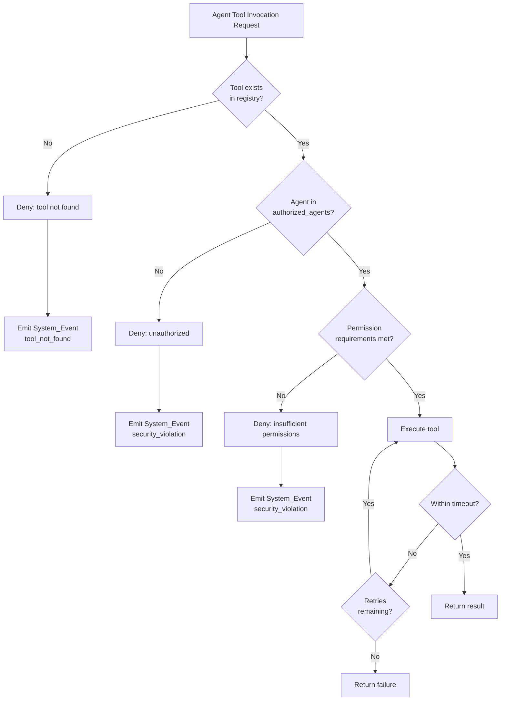

# Tool Registry

Centralized registry of all internal and external tools available to platform agents, defining access control, execution parameters, and MCP compatibility for each tool.

## Overview

The tool registry enforces a deny-by-default access model: agents may only invoke tools explicitly listed in their `authorized_agents` allow-list. Any invocation attempt against an unauthorized or non-existent tool is denied and emits a security violation System_Event.

Tools are classified as:

- **Internal** — platform-native capabilities (filesystem, shell, docker, git)
- **External (MCP-compatible)** — tools exposing a definition conforming to the [Model Context Protocol](https://modelcontextprotocol.io) tool specification (name, description, input schema)

## Tool Entry Schema

```yaml
tool:
  name: string              # Max 64 chars
  category: string
  owner_component: string
  permission_requirements:
    - type: string
      level: string
  authorized_agents: [string]
  timeout_seconds: integer  # 5–300
  retry_policy:
    max_retries: integer    # 1–5
    backoff: enum           # fixed | exponential
  input_schema: object
  output_schema: object
  execution_environment: string
  network_access: boolean
  mcp_compatible: boolean
```

## Internal Tools

### filesystem

```yaml
tool:
  name: "filesystem"
  category: "internal"
  owner_component: "orchestrator"
  permission_requirements:
    - type: "filesystem"
      level: "read"
    - type: "filesystem"
      level: "write"
  authorized_agents:
    - "coder"
    - "reviewer"
    - "infra"
  timeout_seconds: 30
  retry_policy:
    max_retries: 2
    backoff: fixed
  input_schema:
    type: object
    properties:
      operation:
        type: string
        enum: [read, write, list, delete, move, copy]
      path:
        type: string
        description: "Absolute or workspace-relative path"
      content:
        type: string
        description: "File content for write operations"
    required: [operation, path]
  output_schema:
    type: object
    properties:
      success:
        type: boolean
      data:
        type: string
        description: "File content or operation result"
      error:
        type: string
  execution_environment: "host"
  network_access: false
  mcp_compatible: false
```

**Access notes:**
- `reviewer` agent has read-only access (write operations denied at permission layer)
- `coder` and `infra` agents have full read/write access within workspace scope
- Path access is further restricted by the permissions model per agent type

### shell

```yaml
tool:
  name: "shell"
  category: "internal"
  owner_component: "orchestrator"
  permission_requirements:
    - type: "shell"
      level: "execute"
  authorized_agents:
    - "coder"
    - "infra"
  timeout_seconds: 120
  retry_policy:
    max_retries: 1
    backoff: fixed
  input_schema:
    type: object
    properties:
      command:
        type: string
        description: "Shell command to execute"
      working_directory:
        type: string
        description: "Execution directory (defaults to workspace root)"
      environment:
        type: object
        description: "Additional environment variables"
    required: [command]
  output_schema:
    type: object
    properties:
      exit_code:
        type: integer
      stdout:
        type: string
      stderr:
        type: string
  execution_environment: "host"
  network_access: false
  mcp_compatible: false
```

**Access notes:**
- Commands are validated against allowed patterns defined in the permissions model
- Shell execution is sandboxed to the task workspace
- Network-accessing commands are blocked unless the agent also has network permission

### docker

```yaml
tool:
  name: "docker"
  category: "internal"
  owner_component: "orchestrator"
  permission_requirements:
    - type: "docker"
      level: "sandboxed"
  authorized_agents:
    - "coder"
    - "infra"
  timeout_seconds: 300
  retry_policy:
    max_retries: 3
    backoff: exponential
  input_schema:
    type: object
    properties:
      operation:
        type: string
        enum: [build, run, stop, logs, inspect, compose_up, compose_down]
      image:
        type: string
        description: "Docker image reference"
      container_name:
        type: string
      compose_file:
        type: string
        description: "Path to docker-compose.yml"
      options:
        type: object
        description: "Additional Docker options (volumes, ports, env)"
    required: [operation]
  output_schema:
    type: object
    properties:
      success:
        type: boolean
      container_id:
        type: string
      output:
        type: string
      error:
        type: string
  execution_environment: "docker"
  network_access: true
  mcp_compatible: false
```

**Access notes:**
- `coder` operates in sandboxed Docker scope (no host network, limited volume mounts)
- `infra` has full Docker scope for infrastructure management
- Docker socket access is mediated by the orchestrator, never exposed directly

### git

```yaml
tool:
  name: "git"
  category: "internal"
  owner_component: "orchestrator"
  permission_requirements:
    - type: "git"
      level: "read-write"
  authorized_agents:
    - "coder"
    - "reviewer"
    - "infra"
  timeout_seconds: 60
  retry_policy:
    max_retries: 2
    backoff: fixed
  input_schema:
    type: object
    properties:
      operation:
        type: string
        enum: [clone, checkout, commit, push, pull, diff, log, status, branch]
      repository:
        type: string
        description: "Repository path or URL"
      branch:
        type: string
      message:
        type: string
        description: "Commit message"
      options:
        type: object
    required: [operation]
  output_schema:
    type: object
    properties:
      success:
        type: boolean
      output:
        type: string
      error:
        type: string
  execution_environment: "host"
  network_access: false
  mcp_compatible: false
```

**Access notes:**
- `reviewer` has read-only Git access (diff, log, status operations only)
- `coder` and `infra` have read-write access
- Push to protected branches requires approval gate (see approval model)

## External MCP-Compatible Tools

External tools conform to the Model Context Protocol tool specification, exposing a standard tool definition with name, description, and JSON Schema input.

### web_search

```yaml
tool:
  name: "web_search"
  category: "external"
  owner_component: "mcp-gateway"
  permission_requirements:
    - type: "network"
      level: "read"
  authorized_agents:
    - "researcher"
  timeout_seconds: 30
  retry_policy:
    max_retries: 3
    backoff: exponential
  input_schema:
    type: object
    properties:
      query:
        type: string
        description: "Search query string"
      max_results:
        type: integer
        description: "Maximum number of results to return"
        default: 10
    required: [query]
  output_schema:
    type: object
    properties:
      results:
        type: array
        items:
          type: object
          properties:
            title:
              type: string
            url:
              type: string
            snippet:
              type: string
      total_results:
        type: integer
  execution_environment: "container"
  network_access: true
  mcp_compatible: true
```

**MCP tool definition:**
```json
{
  "name": "web_search",
  "description": "Search the web for information using a query string. Returns titles, URLs, and snippets.",
  "inputSchema": {
    "type": "object",
    "properties": {
      "query": {
        "type": "string",
        "description": "Search query string"
      },
      "max_results": {
        "type": "integer",
        "description": "Maximum number of results to return",
        "default": 10
      }
    },
    "required": ["query"]
  }
}
```

### code_analysis

```yaml
tool:
  name: "code_analysis"
  category: "external"
  owner_component: "mcp-gateway"
  permission_requirements:
    - type: "filesystem"
      level: "read"
  authorized_agents:
    - "coder"
    - "reviewer"
  timeout_seconds: 120
  retry_policy:
    max_retries: 2
    backoff: fixed
  input_schema:
    type: object
    properties:
      file_path:
        type: string
        description: "Path to file or directory to analyze"
      analysis_type:
        type: string
        enum: [lint, complexity, security, dependencies]
        description: "Type of analysis to perform"
      language:
        type: string
        description: "Programming language (auto-detected if omitted)"
    required: [file_path, analysis_type]
  output_schema:
    type: object
    properties:
      findings:
        type: array
        items:
          type: object
          properties:
            severity:
              type: string
              enum: [info, warning, error, critical]
            message:
              type: string
            location:
              type: object
              properties:
                file:
                  type: string
                line:
                  type: integer
      summary:
        type: object
        properties:
          total_findings:
            type: integer
          by_severity:
            type: object
  execution_environment: "container"
  network_access: false
  mcp_compatible: true
```

**MCP tool definition:**
```json
{
  "name": "code_analysis",
  "description": "Analyze source code for quality issues including linting, complexity, security vulnerabilities, and dependency problems.",
  "inputSchema": {
    "type": "object",
    "properties": {
      "file_path": {
        "type": "string",
        "description": "Path to file or directory to analyze"
      },
      "analysis_type": {
        "type": "string",
        "enum": ["lint", "complexity", "security", "dependencies"],
        "description": "Type of analysis to perform"
      },
      "language": {
        "type": "string",
        "description": "Programming language (auto-detected if omitted)"
      }
    },
    "required": ["file_path", "analysis_type"]
  }
}
```

## Authorization Matrix

| Tool | Planner | Coder | Reviewer | Infra | Researcher |
|------|---------|-------|----------|-------|------------|
| filesystem | ✗ | ✓ (read/write) | ✓ (read-only) | ✓ (read/write) | ✗ |
| shell | ✗ | ✓ | ✗ | ✓ | ✗ |
| docker | ✗ | ✓ (sandboxed) | ✗ | ✓ (full) | ✗ |
| git | ✗ | ✓ (read-write) | ✓ (read-only) | ✓ (read-write) | ✗ |
| web_search | ✗ | ✗ | ✗ | ✗ | ✓ |
| code_analysis | ✗ | ✓ | ✓ | ✗ | ✗ |

## Access Control Enforcement



## Related Documents

- [Agent Catalog](../agents/catalog.md) — defines agent types referenced in authorized_agents lists
- [Permissions Model](../security/permissions.md) — detailed permission rules per agent type
- [Event Taxonomy](../events/taxonomy.md) — security violation events emitted on denied access

## Revision History

| Date | Author | Change Description |
|------|--------|--------------------|
| 2025-07-14 | Platform Architect | Initial tool registry with 4 internal and 2 external MCP tools |
